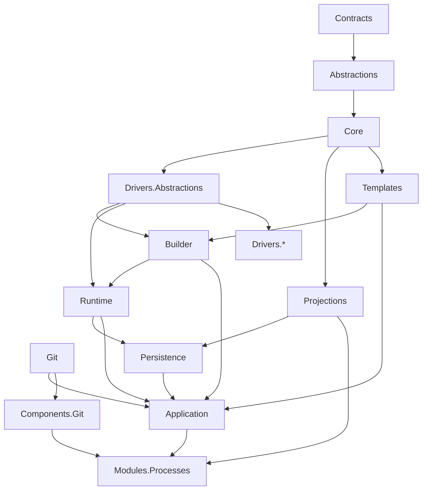

# Project By Project Rebuild Plan

## Design Intent

The rewrite proceeds from stable contracts to UI. v3 corrects the v2 order: `Processes.Drivers.Abstractions` must exist before Builder, and projection contracts must exist before UI.

## Dependency Graph

## Rebuild Matrix

| Order | Project | Depends on | Main deliverable | Required tests | Stop condition |
| --- | --- | --- | --- | --- | --- |
| 1 | `CanDoItAll.Processes.Contracts` | none | External DTOs, API contracts, version markers. | Serialization, compatibility, no infrastructure references. | Runtime behavior appears in contracts. |
| 2 | `CanDoItAll.Processes.Abstractions` | Contracts | IDs, capability tags, generic interfaces and ports. | Contract shape, nullability, domain leakage scan. | Concrete driver or UI reference appears. |
| 3 | `CanDoItAll.Processes.Core` | Contracts, Abstractions | Graph rules, artifact core, branch core, loop fingerprints, state machines. | Pure unit tests for graph, artifacts, branches, loop fingerprints, transitions. | EF/Razor/domain dependency appears. |
| 4 | `CanDoItAll.Processes.Drivers.Abstractions` | Contracts, Abstractions, Core | Driver descriptors, packages, capability matching, strategy factory contracts. | Compatibility, capability matching, conflict tests. | Concrete domain behavior enters abstractions. |
| 5 | `CanDoItAll.Processes.Projections` | Contracts, Abstractions, Core | Projection DTOs and read-model contracts. | DTO serialization, freshness metadata, sensitivity, no EF/runtime implementation references. | UI-specific component logic appears. |
| 6 | `CanDoItAll.Git` | shared primitives only | Typed Git wrapper and path authorization. | Status/diff/commit/merge/conflict/path/log sanitization tests. | Process-specific behavior appears. |
| 7 | `CanDoItAll.Processes.Templates` | Core, Abstractions | JSON schemas, component refs, overrides, migrations, merge/conflict logic. | Schema, migration chain, merge/conflict, projection hash tests. | Markdown/Mermaid becomes canonical. |
| 8 | `CanDoItAll.Processes.Builder` | Core, Templates, Drivers.Abstractions | Compiler pipeline and immutable instance plan. | Driver stack, strategy binding, subprocess recursion, branch table, plan hash, failure diagnostics. | Runtime performs missing composition. |
| 9 | `CanDoItAll.Processes.Runtime` | Core, Builder contracts, Drivers.Abstractions | Runtime transitions, scheduler, dispatcher contracts, event ports. | State machine, event, claim lease, cancellation, idempotency, budget tests. | Dispatcher contains domain recovery decisions. |
| 10 | `CanDoItAll.Processes.Persistence` | Core, Runtime ports, Projections | EF/event store, runtime state tables, artifact ledger, outbox, projection stores. | Repository, concurrency, event/outbox, replay, dead-letter tests. | Runtime or UI references persistence implementation types. |
| 11 | `CanDoItAll.Processes.Application` | Builder, Runtime, Persistence, Templates, Projections, Git | Use cases, authorization, template Git orchestration, run start, projection queries. | Use-case, authorization, transaction, error mapping tests. | Application bypasses runtime transitions. |
| 12 | `CanDoItAll.Processes.Drivers.*` | Drivers.Abstractions | Concrete driver packages and strategy implementations. | Driver contract, strategy result, diagnostic redaction, negative fixtures. | Generic runtime code changes required for one driver. |
| 13 | `CanDoItAll.Components.Git` | Git | Generic Git status/diff/commit/merge/conflict components. | Component tests, authorization state tests. | Process-specific UI assumptions appear. |
| 14 | `CanDoItAll.Modules.Processes` | Application, Projections, Components.Git | Blazor Process UI rebuilt over projections. | Component tests, Playwright live/history/canvas/template flows. | UI reads EF runtime internals or computes runtime truth. |

## Refactoring Review Checkpoint Per Stage

Every project stage must record:

- dependency scan result,
- domain vocabulary scan result,
- old-symbol scan result,
- large-file review,
- pure-rule extraction review,
- negative/failure test review,
- handoff note for next project.

## Required E2E Scenarios Before Final Rewrite Closure

- Generic process with normal, approval, branch, and end steps.
- Subprocess step with artifact import/export and parent/child manager messages.
- Missing artifact recovery and resupply.
- Backward branch route hitting loop budget and escalation.
- Live Processes last-hour view excludes old completed events while keeping active runs visible.
- Template global component update with local override conflict and manual resolution.
- Git manager audit detects unauthorized agent mutation.
- Representative software-delivery flow using layered drivers.
- Runtime history compatibility route for legacy runs.

## Stop Rules

- Stop if a future implementation reintroduces the old dispatcher as a wrapped service.
- Stop if runtime selects strategies dynamically instead of using the plan.
- Stop if UI reads runtime EF entities directly.
- Stop if template migrations skip intermediate schema versions.
- Stop if branch routing depends on free-text outcome names.
- Stop if raw diagnostics are displayed directly in normal UI projections.
- Stop if old runtime code is kept alive only for history display.
