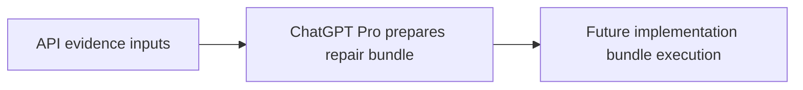

# Phase Plan

This bundle is input-only. The actual phase plan is deferred to ChatGPT Pro.

## Subbundle Dependency Map

## Critical Subbundles

- Not defined in this input package.

## Phase Gates

- Gate for this package: raw API payloads and the evidence index exist.
- Future gates: deferred to the implementation-ready bundle that ChatGPT Pro prepares.
