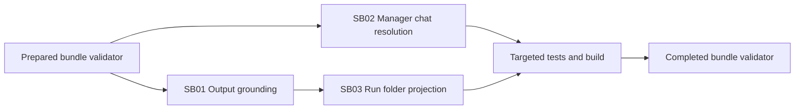

# Phase Plan

## Phase Sequence

1. Prepare and validate this bundle.
2. Execute SB01 output grounding because downstream process behavior depends on correct prompt context.
3. Execute SB02 manager chat resolution because it is independent of output grounding but user-visible in the same Processes page.
4. Execute SB03 run folder artifact projection because it affects project structure graph shape and should be validated after grounding assumptions are stable.
5. Run targeted tests, build validation, browser/API smoke where possible, and the completed-stage bundle validator.

## Subbundle Dependency Map

## Critical Subbundles

- SB01 is a critical process foundation: if output paths are not grounded, a successful process can still deliver to the wrong folder.
- SB02 is a critical UI/runtime support fix: if manager resolution remains divergent, users cannot inspect completed runs through the expected manager chat path.
- SB03 is a project-structure usability fix: weak grouping would leave the graph noisy and make artifact folders hard to open.

## Phase Gates

- Gate after preparation: run the bundle validator and repair failures.
- Gate before each subbundle: confirm prerequisites are complete and still valid.
- Gate after each subbundle: capture proof, review screenshots, and decide whether downstream work may continue.
- Gate before closure: rerun validators, close raw notes, and reopen anything with weak proof.
