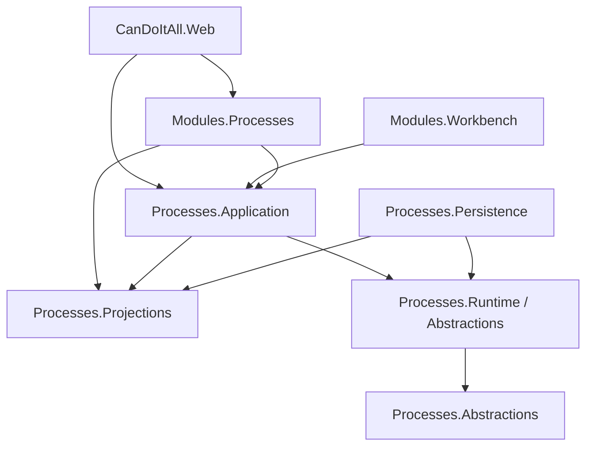

# C# Boundary Map

## Ownership

| Concern | Owner | Must not own |
| --- | --- | --- |
| Runtime terminal/escalation facts | Runtime | Persistence schema, LLM calls |
| Run-record contracts | Projections | EF entities, provider SDK types |
| Deterministic assembly and query use cases | Application | Agent Framework file access, HTTP |
| Record storage/query and leases | Persistence | Manager selection policy |
| Execution evidence and structured manager generation | Modules.Processes | Runtime transitions |
| Project-structure rendering | Modules.Workbench | Reconstructing terminal evidence |
| HTTP validation/mapping | Web API | Data assembly or provider policy |

## Dependency Direction

Runtime must not point upward to Application, Projections, Persistence, Modules, or Web.

## Integration Seams

- `IProcessRunRecordStore`: idempotent upsert, typed query, get, analytics, narrative claim/update.
- `IProcessRunRecordReader`: narrow Application-owned list seam used by Workbench; it exposes no mutation or claim authority.
- `IProcessRunEvidenceReader`: projection-shaped hard evidence independent of Agent Framework concrete types.
- `IProcessRunNarrativeGenerator`: structured summary generation independent of provider SDK.
- `ProcessRunRecordFinalizer`: application coordinator called by asynchronous projection/finalization infrastructure.
- `ProcessRunRecordQueryService`: bounded list/detail/analytics use cases.

Interfaces are justified because each crosses a project, persistence, provider, or test boundary. Pure mapping helpers remain concrete/static.
