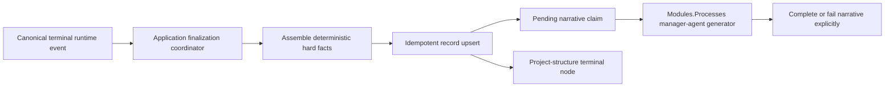
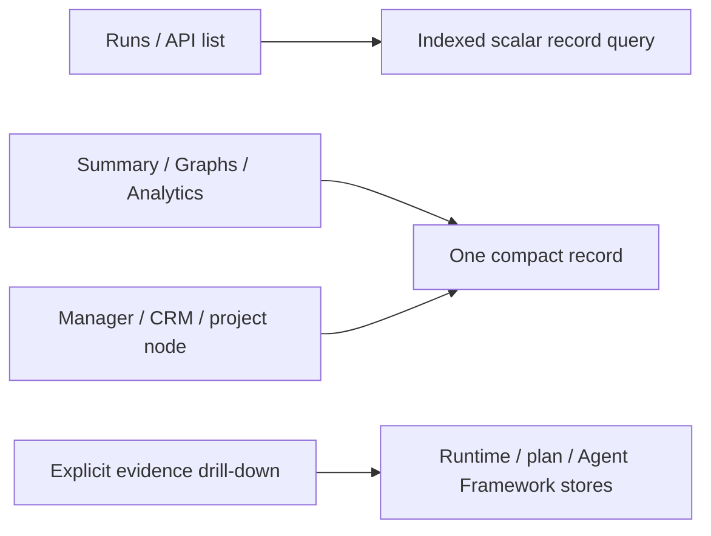

# Target Solution

## Read Model

Add a dedicated `ProcessRunRecord` read model with one current row per process run. Scalar indexed columns support common filters and ordering. Strongly typed JSON payloads hold bounded lists and aggregates without ORM navigation relationships.

The record contains:

- Identity: run, root, parent, definition, definition version, project, and plan IDs.
- Lifecycle: versioned final disposition, started/ended timestamps, duration, snapshot version, updated timestamp, and payload hash.
- Hard facts: step outcomes, attempts/repetitions, actor/agent/executor/workflow IDs, subprocess IDs, token/cost/tool totals, result/artifact references, and graph/analytics aggregates.
- Quality: typed completeness flags for each optional evidence source.
- Narrative: explicit generation state and a structured manager summary containing overview, completed work, problems, decisions, follow-ups, and outcome.

## Write Flow

- Hard facts commit without waiting for an LLM.
- A durable claim/lease and attempt count make narrative work multi-host safe and retryable.
- Reprocessing the same event compares record version/hash and is idempotent.
- `Escalated` is reserved in the record contract. The current manager-loop escalation is not an ending event and does not seed a record; an explicit runtime ending transition is required before the disposition can be emitted.
- Backfill uses the same assembler but records missing evidence through completeness flags.

## Read Flow

Normal historic consumers never load canonical state or execution details per row. Explicit evidence detail remains available under an intentionally named path.

## Performance Corrections Around The Boundary

- Stop synchronously replaying projection writes in GET endpoints; expose persisted source sequence/data-through watermarks separately from record stage-update time when a consumer depends on an asynchronously updated projection.
- Apply filters and limits in SQL before payload materialization.
- List Agent Framework execution summaries once for a requested process-run set; hydrate detail only when requested.
- Avoid `Task.WhenAll` over scoped EF stores. Use batch queries/projection-shaped reads, or an independent scope where actual concurrency is warranted.
- Replace raw 10,000-event analytics reconstruction with record aggregates for terminal history.

## Allowed Side Effects

- Additive database schema/migration and DI registration.
- New projection/application/persistence/module services and strongly typed API DTOs.
- Small changes to existing read services and consumers to select the compact path.
- Tests, bundle evidence, and SharedInfo API skill updates.

## Explicit Non-Goals

- Do not delete canonical runtime/event/evidence stores.
- Do not place full prompts, logs, tool arguments, or secrets in the record.
- Do not redesign the Runs/Graphs/Analytics UI.
- Do not create a new project or generic repository abstraction unless an existing project boundary proves insufficient.
