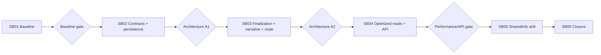

# Phase Plan

## Phase Sequence

1. Characterize current read amplification and preserve it as regression evidence.
2. Add record contracts, query model, EF persistence, indexes, and migration.
3. Assemble deterministic facts on disposition events, add asynchronous structured narrative, and switch terminal project nodes.
4. Add bounded list/summary/analytics APIs and move applicable consumers to record reads while keeping deep evidence explicit.
5. Update the authoritative SharedInfo API skill after route tests pass.
6. Repeat performance scan, run architecture gate/build/tests, and close the bundle.

## Subbundle Dependency Map

## Critical Subbundles

- SB01: Behavioral baseline; later claims must compare their call/query shape against its evidence.
- SB02: Behavioral critical foundation; schema, identity, disposition, completeness, indexes, and dependency direction must pass before finalization.
- SB03: Behavioral critical foundation; idempotency, terminal-event classification, async narrative, privacy, and project-node behavior must pass before consumers.
- SB04: Behavioral; API/consumer tests must prove bounded snapshot-only history paths.
- SB05: Standard; documentation readback must match implemented and tested routes.
- SB06: Behavioral final closure; all earlier gates, build, tests, migration, performance pass, and architecture review must be complete.

## Phase Gates

- Gate after preparation: run the bundle validator and repair failures.
- Gate before each subbundle: confirm prerequisites are complete and still valid.
- Gate after each subbundle: capture proof, review screenshots, and decide whether downstream work may continue.
- Gate before closure: rerun validators, close raw notes, and reopen anything with weak proof.
- Architecture checkpoints are defined in `plan/architecture-checkpoints.md`.

## UI Target Policy

- CanDoItAll applications target large-screen desktop viewports. Do not add small/medium/mobile tuning unless explicitly requested.
- Reusable basic `CanDoItAll.Components.BaseLib` work validates small, medium, and large viewports.
