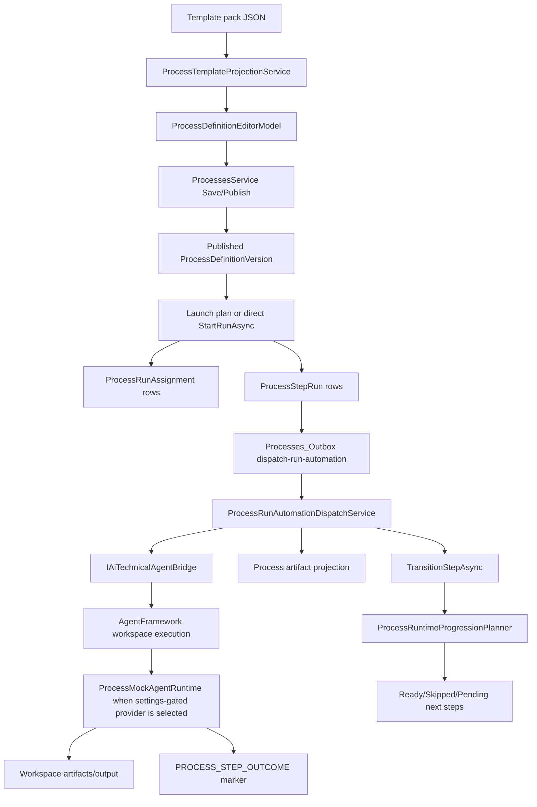

# Current State

## Execution Core Map

## Important Current Behaviors

- `ProcessTemplatePackLoader` loads `Templates/Processes` definitions and shared roles, artifacts, prompts, validations, and checklists.
- `ProcessTemplateProjectionService` projects template roles, steps, dependencies, branch outcomes, artifact expectations, and artifact inputs into the current `ProcessDefinitionEditorModel`.
- `ProcessesService.StartRunAsync` creates a process run from a published definition or an approved launch plan, resolves assignments, creates step runs, enqueues run-start activity, enqueues automation dispatch, commits, then calls `TriggerOutboxProcessingInBackground`.
- `ProcessesService.TransitionStepAsync` validates status transitions, branch outcome selection, and required artifacts, applies dependency consequences, updates run status, records decisions and journal entries, then enqueues automation dispatch unless suppressed.
- `ProcessOutboxService` owns durable side effects and routes `dispatch-run-automation` records to `ProcessRunAutomationDispatchService`.
- `ProcessRunAutomationDispatchService` only dispatches a step when it can resolve a current executor party to a bound technical agent. It then executes the AgentFramework run with `process-step` context, enforces governed outcome markers, required tool evidence, artifact expectations, and branch outcome selection.
- `ProcessMockAgentCatalogService` seeds a settings-gated mock provider and mock agents with fixed CRM-HR party IDs.
- `ProcessMockAgentRuntime` writes deterministic calculator artifacts and emits `PROCESS_STEP_OUTCOME` comments, including `repairs-required` and `approved` branch keys for QA.

## Template Flow Findings

### `software-delivery`

- Roles: `product-owner`, `delivery-manager`, `solution-architect`, `lead-engineer`, `qa-lead`, `security-reviewer`, `release-manager`.
- Steps: feature intake, architecture review, implementation, peer review, QA validation, security review, release approval, rollout, post-release learning.
- No branch outcomes are defined. There is no deterministic QA reject -> developer repair -> QA recheck loop.

### `ai-assisted-change-delivery`

- Roles include person-only governance roles plus `software-engineer`.
- Branches:
  - `delegation-design`: `delegate` or `human-only`.
  - `safety-and-security-review`: `approved` or `rework`.
- The `rework` branch ends at `capture-rework-decision`; it does not loop to an implementation repair step and then back to QA/security approval.

## Mock-Agent Fit Findings

- Current mock role keys are `product-owner`, `architect`, `developer`, `qa`, `repair-developer`, and `release-manager`.
- These do not fully match template role keys such as `solution-architect`, `lead-engineer`, `software-engineer`, and `qa-lead`.
- The launch candidate scorer can discover AI resources, but without explicit role-key alignment it can select the wrong mock agent or a proposed new AI agent.
- Direct `StartRunAsync` without a launch plan uses project assignment roles, not the mock catalog role keys.

## Tested Evidence

- `ProcessMockAgentRuntimeIntegrationTests`: passed 3/3. This proves catalog seeding, settings gating, direct mock execution, QA rejection, repair artifact, and QA approval at the AgentFramework runtime level.
- Focused dispatch/mock/outbox test run: 113 passed, 17 failed out of 130. Failures cluster around stale dispatch tests and stricter completion behavior.
- Focused process-service branch/artifact/dependency tests: 5 passed, 2 failed during teardown because `primary.db` remained locked.
- `ProcessOutboxIntegrationTests`: 6 passed, 1 failed during teardown because `primary.db` remained locked after `StartRunAsync`.
- `CanDoItAll.Mcp.Processes.Tests` template validation project does not compile because `ProcessTemplatePackLoaderTests` calls `AddProcessesModule` without the now-required `IConfiguration`.

## Primary Weak Spots

1. `StartRunAsync` launches automation dispatch with an untracked `Task.Run`. Tests and possibly short-lived hosts can dispose while the background task still holds SQLite resources.
2. The process template validation suite is currently non-runnable due to an API signature drift.
3. Dispatch tests are stale against changed internal method signatures and current completion semantics.
4. There is no process-level integration test that starts a process run, staffs it with mock agents, drives durable dispatch, and proves final completion.
5. Existing templates do not model the requested QA repair loop with branch keys matching the mock runtime.
6. Mock role keys and template role keys are not aligned enough for deterministic staffing.
7. Strict dispatcher proof requirements can reject mock agents if their file writes are not projected as expected process artifacts or required tool evidence.
