# Target Solution

## Architecture

```mermaid
flowchart LR
    Settings["AgentFramework:ProcessMockAgents:Enabled"] --> Catalog["ProcessMockAgentCatalogService"]
    Catalog --> Roles["Deterministic role aliases and party IDs"]
    Roles --> Launch["Launch plan candidate selection"]
    Launch --> Run["ProcessesService.StartRunAsync"]
    Run --> DurableOutbox["ProcessOutboxService"]
    DurableOutbox --> Dispatch["ProcessRunAutomationDispatchService"]
    Dispatch --> MockAgent["ProcessMockAgentRuntime"]
    MockAgent --> Artifacts["Durable workspace artifacts"]
    MockAgent --> Outcome["Typed outcome marker"]
    Artifacts --> ProcessArtifacts["ProcessArtifactRecord projection"]
    Outcome --> Branch["Branch outcome selection"]
    Branch --> Progress["ProcessRuntimeProgressionPlanner"]
    Progress --> Complete["Run completed"]
```

## Target Process Shape

The deterministic calculator process should have this minimum runtime graph:

1. Product owner writes calculator scope.
2. Architect writes implementation constraints.
3. Developer writes first implementation with deterministic divide-by-zero defect.
4. QA review selects `repairs-required`.
5. Repair developer writes corrected implementation.
6. QA recheck selects `approved`.
7. Release manager writes release notes.
8. Run completes with all required artifacts recorded.

## Boundaries

- Runtime lifecycle and dispatch reliability must be fixed before adding E2E proof.
- Mock-agent path must remain opt-in and must not change real provider behavior.
- The dispatcher should not gain broad "mock fallback" logic. Any mock-specific evidence handling must be explicit, typed, and scoped to the mock provider or deterministic test fixture.
- Template changes should be isolated. Do not mutate the generic `software-delivery` process into a test scenario unless that is a deliberate product decision.

## Validation Strategy

- Start with focused tests that currently fail: process outbox, process service branch/dependency tests, template-pack tests, and dispatch completion tests.
- Add a deterministic process definition/template test that exercises branch outcomes and artifact expectations before AgentFramework is involved.
- Add launch/staffing tests that prove every required process role resolves to the intended mock technical agent.
- Add dispatcher-level tests proving mock outcomes, branch keys, and artifacts are accepted without weakening real governed checks.
- Finish with one true E2E test that enables mock mode, creates/loads the calculator process, starts a run, drains automation dispatch, and asserts final completion.
