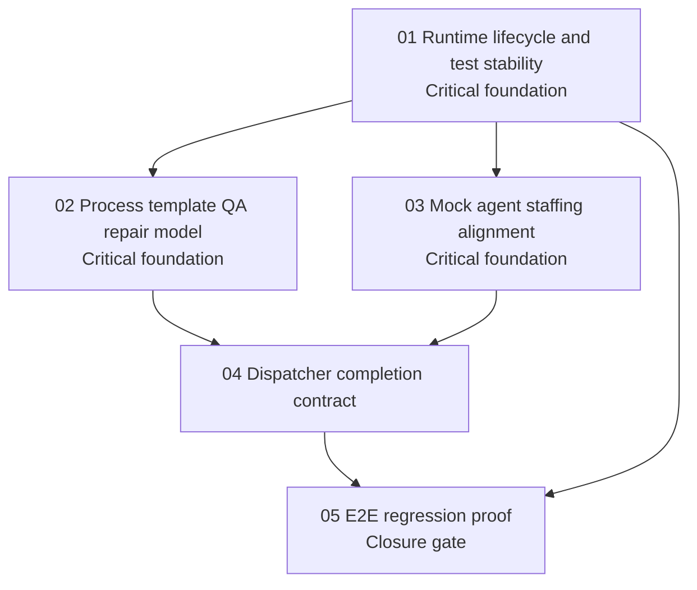

# Phase Plan

## Phase Sequence

1. Stabilize runtime lifecycle and focused test suites.
2. Define the deterministic calculator process model with explicit QA repair branches.
3. Align mock-agent roles and launch staffing so process roles bind to the intended mock technical agents.
4. Make dispatcher completion and artifact projection accept deterministic mock evidence through explicit contracts.
5. Add E2E regression proof and close the bundle only after the process finishes through automation dispatch.

## Subbundle Dependency Map

## Critical Subbundles

- `01-runtime-lifecycle-and-test-stability`: critical foundation. Later proof is unreliable while background dispatch can outlive tests or while core validation suites cannot run.
- `02-process-template-qa-repair-model`: critical foundation. Later dispatch proof is meaningless without a process graph that actually contains the QA repair loop.
- `03-mock-agent-staffing-alignment`: critical foundation. E2E automation cannot be deterministic unless launch roles bind to the intended mock agents.

## Phase Gates

- Preparation gate: run bundle validation and repair structure, traceability, and subbundle proof gaps.
- Gate after subbundle 01: process outbox, process service branch/dependency, dispatch, and template validation focused tests must be executable without teardown file locks or compile failures.
- Gate after subbundle 02: deterministic calculator process definition/template must prove branch outcomes and required artifact expectations without AgentFramework.
- Gate after subbundle 03: launch/staffing proof must show exact mock technical agent bindings for all required roles.
- Gate after subbundle 04: dispatcher tests must prove mock outcome parsing, branch selection, artifact projection, and negative diagnostics.
- Closure gate after subbundle 05: one E2E mock-agent process run must complete without real LLM calls, without dead-letter outbox records, and with QA reject/repair/approve evidence recorded.
