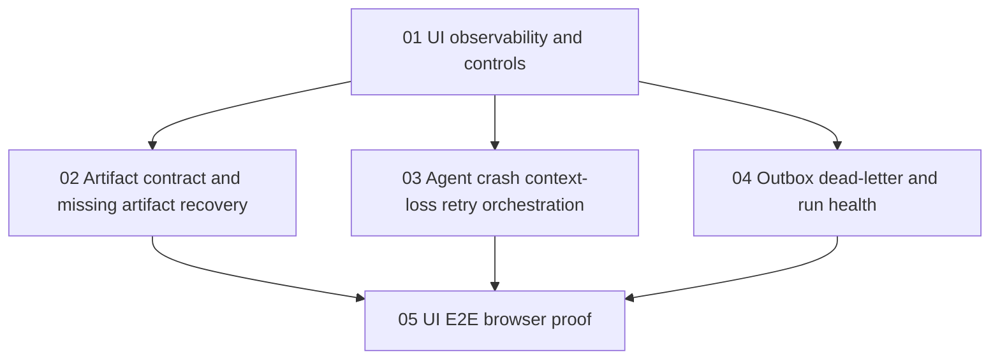

# Phase Plan

## Phase Sequence

1. Implement UI run observability and operator controls first, because every later recovery workflow needs a trustworthy read model.
2. Implement artifact expectation and missing-artifact recovery second, because agent success must not be confused with process completion.
3. Implement agent crash, context-loss, and retry orchestration third, reusing the new observability and artifact ledger.
4. Implement outbox dead-letter and run-health operations fourth, tying infrastructure failures back to process run health.
5. Implement browser E2E proof last, after all user-visible states and controls exist.

## Subbundle Dependency Map

## Critical Subbundles

- Subbundle 01 is the foundation: do not implement retry buttons or dead-letter operations until UI state is trustworthy.
- Subbundle 02 is process-correctness critical: do not let produced AgentFramework files imply required process artifacts are satisfied without explicit mapping.
- Subbundle 03 is operationally critical: users need a safe way to make an agent do the job again after crash or context loss.
- Subbundle 04 is infrastructure-critical: a dead-lettered dispatch must become a visible process health problem.
- Subbundle 05 is closure-critical: browser proof must exercise the real UI path, not only backend services.

## Phase Gates

- Gate after subbundle 01: operator can explain run state from UI alone for active, blocked, failed, retrying, and waiting states.
- Gate after subbundle 02: every required artifact expectation has a visible satisfied/missing/projected/failed state.
- Gate after subbundle 03: a failed or stranded agent-owned step can be rerun from UI with a visible recovery directive and audit trail.
- Gate after subbundle 04: pending, retrying, and dead-lettered automation records are visible and actionable from Process Workspace.
- Gate after subbundle 05: Playwright proves launch, observation, artifact review, and at least one recovery path through the browser.
