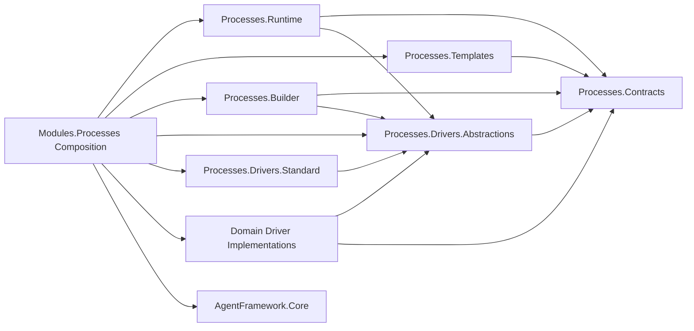

# C# Dependency Direction

## Current Scoped Direction

CodeAnalytics snapshot `snap-20260709171252-c371d5d2` found no cycles in the scoped process/runtime/driver/module graph.

Current direct references relevant to this bundle:

```text
CanDoItAll.Modules.Processes
  -> CanDoItAll.AgentFramework.Core
  -> CanDoItAll.Processes.Builder
  -> CanDoItAll.Processes.Drivers.Abstractions
  -> CanDoItAll.Processes.Drivers.Standard
  -> CanDoItAll.Processes.Runtime
  -> CanDoItAll.Processes.Templates

CanDoItAll.Processes.Runtime
  -> CanDoItAll.Processes.Builder
  -> CanDoItAll.Processes.Contracts
  -> CanDoItAll.Processes.Drivers.Abstractions

CanDoItAll.Processes.Drivers.Standard
  -> CanDoItAll.Processes.Drivers.Abstractions

CanDoItAll.Processes.Drivers.Abstractions
  -> CanDoItAll.Processes.Contracts
```

## Required Target Direction

```text
Modules.Processes
  -> AgentFramework.Core
  -> Processes.Runtime
  -> Processes.Templates
  -> Processes.Builder
  -> Processes.Drivers.Abstractions
  -> Processes.Drivers.Standard
  -> Domain driver implementation packages

Processes.Runtime
  -> Processes.Contracts
  -> Processes.Drivers.Abstractions
  -> Processes.Builder only where existing runtime construction requires it

Processes.Drivers.Standard
  -> Processes.Drivers.Abstractions

Domain driver implementations
  -> Processes.Drivers.Abstractions
  -> Processes.Contracts
  -> Tool/protocol abstractions as needed

AgentFramework.Core
  -> tool abstractions/protocol contracts only
  -> no Processes module dependency
```

## Forbidden Direction

```text
Processes.Contracts -> Modules.Processes
Processes.Drivers.Abstractions -> Modules.Processes
Processes.Runtime -> Modules.Processes
Processes.Runtime -> concrete domain driver implementation
AgentFramework.Core -> Modules.Processes
AgentFramework.Core -> Processes.Runtime for receipt lifecycle classification
Generic runtime -> Tetris/Calculator/.NET/Blazor-specific implementation
```

## Contract Placement Rules

- If a record is serialized/stored or used by runtime, templates, and module integration, place it in `Processes.Contracts`.
- If an interface is implemented by a driver or domain policy and consumed by runtime/adapter, place it in `Processes.Drivers.Abstractions`.
- If an interface is only an internal module test seam around MAF-specific code, keep it in `Modules.Processes`.
- If a type mentions MAF execution-run models, keep it out of `Processes.Runtime` unless an abstraction is introduced.
- If a type mentions concrete .NET tool names or software-delivery step keys, keep it in a domain implementation or template package.

## Proof Required During Implementation

Each subbundle that changes project references must capture:

1. Before project reference list.
2. After project reference list.
3. CodeAnalytics dependency/cycle result.
4. Source assertion that contracts do not reference implementation/module/UI projects.
5. Source assertion that runtime does not reference concrete domain driver implementations.

## Mermaid Dependency Target



