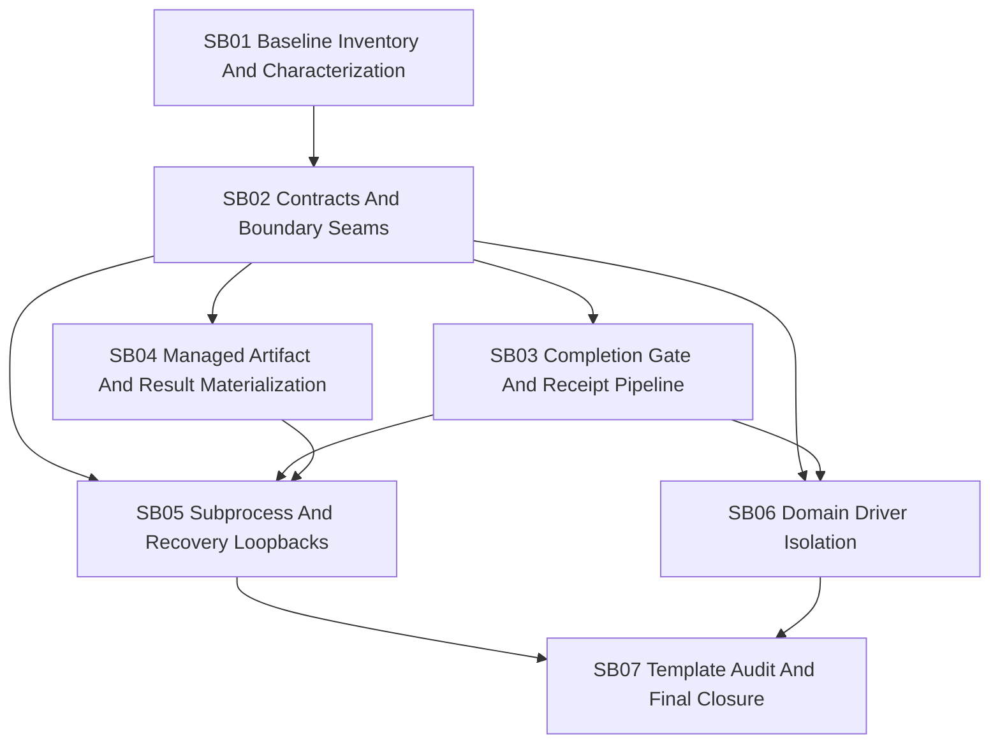

# Phase Plan

## Execution Order

1. SB01 establishes current behavior and architecture baseline.
2. SB02 creates or confirms the contract seams and project boundaries.
3. SB03 extracts completion gate and receipt pipeline behavior.
4. SB04 extracts managed artifact and result materialization.
5. SB05 extracts subprocess and recovery loopback behavior.
6. SB06 isolates .NET/software-delivery lifecycle and tool-plan behavior behind domain driver/tool classifier seams.
7. SB07 audits templates/artifacts and closes validation.

## Subbundle Dependency Map

## Critical Subbundles

| Subbundle | Critical foundation reason |
|---|---|
| SB01 | Prevents behavior loss and captures partial-class/domain-leak baseline before movement. |
| SB02 | Defines contract/project boundaries; mistakes here create cycles or fake abstractions. |
| SB03 | Handles the root completion/receipt branch-routing failure class identified by GPTPro. |
| SB06 | Removes domain leaks from adapter and MAF receipt writer; essential for generic runtime integrity. |
| SB07 | Proves the fix is not limited to the observed blocked example and closes architecture gates. |

## Phase Gates

### Gate A: Preparation Complete

Pass criteria:

- Bundle includes current-state inventory, boundary map, dependency direction, pattern records, testability plan, subbundles, traceability, and C# architecture gate.
- No production source files changed by preparation.

### Gate B: After SB01

Pass criteria:

- Characterization tests exist for behavior that will be moved.
- Source inventory records adapter partial files, domain term locations, and current dependency graph.
- No production refactor has started without baseline.

### Gate C: After SB02

Pass criteria:

- Contracts are placed in correct projects.
- No project cycles.
- No contract references implementation/module/UI projects.
- New abstractions have concrete test seams and are not trivial one-method wrappers unless they define a real driver boundary.

### Gate D: After SB03/SB04/SB05

Pass criteria:

- Extracted services are top-level types with direct unit tests.
- Adapter partial files shrink.
- Gate evaluation aggregates issues and supports branch-aware routing metadata.
- Managed artifacts and subprocess bridge use typed services.

### Gate E: After SB06

Pass criteria:

- Adapter no longer directly references `IDotNetSolutionSetupRuntimeExecutor`.
- `WorkspaceCommandReceiptWriter` no longer has `IsDotNetRuntimeLifecycleTool`.
- .NET lifecycle/tool-plan behavior is provided by driver/tool classifier implementation.
- Generic runtime/dispatcher source assertions pass.

### Gate F: Final Closure

Pass criteria:

- No new adapter partial files.
- Old adapter partial responsibilities are removed or explicitly blocked as remaining debt with dated follow-up.
- CodeAnalytics dependency/cycle check passes.
- Targeted unit tests, build, and process regression tests pass.
- Template/artifact audit proves coverage beyond the original blocked process example.
- Architecture review gate status is `Pass`.

## Subbundle Summaries

| Id | Name | Goal |
|---|---|---|
| SB01 | Baseline Inventory And Characterization | Lock current behavior and create exact source/dependency baseline. |
| SB02 | Contracts And Boundary Seams | Introduce narrow contracts and DI seams in correct projects. |
| SB03 | Completion Gate And Receipt Pipeline | Extract branch-aware gate and receipt evaluation from adapter. |
| SB04 | Managed Artifact And Result Materialization | Extract managed artifact materialization/acceptance and result conversion. |
| SB05 | Subprocess And Recovery Loopbacks | Extract child state resolution, parent bridge, recovery classifier, and repair packet builder. |
| SB06 | Domain Driver Isolation | Move .NET/software-delivery lifecycle/tool-plan logic behind driver/tool classifier contracts. |
| SB07 | Template Audit And Final Closure | Audit all relevant templates/artifacts, run regressions, and close architecture gates. |
