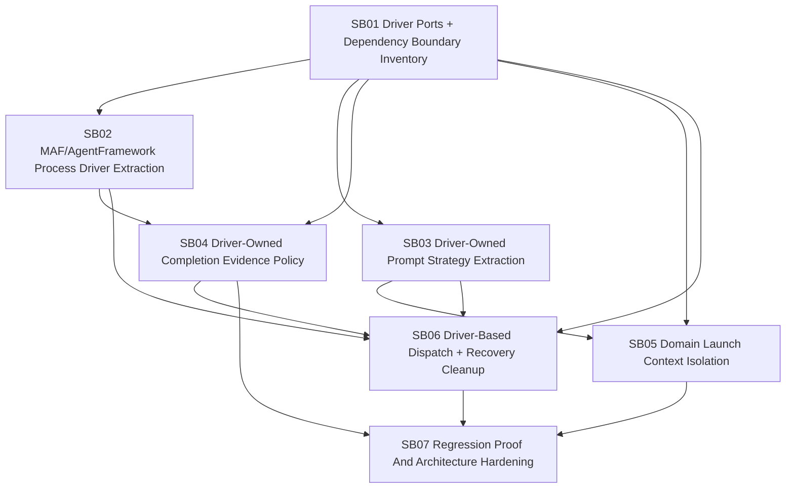

# Phase Plan

## Phase Sequence

1. SB01 stabilizes driver ports, dependency direction, responsibility inventory, project placement, and measurable extraction targets.
2. SB02 extracts the AgentFramework/MAF process driver below the Processes boundary while preserving subprocess, agent execution, output validation, and result conversion behavior.
3. SB03 extracts prompt and brief composition into driver-owned typed strategies and contributors, preserving current AgentFramework prompt content and generic non-software prompts.
4. SB04 extracts completion evidence, receipt, managed artifact, product path, file content, and grounding policies into driver-owned evidence services.
5. SB05 isolates .NET/software-delivery/project-structure launch context into domain contributors and proves unrelated enterprise process definitions remain clean.
6. SB06 integrates driver-based step execution dispatch with the generic dispatcher, cleans branch/recovery responsibilities, removes stale duplicated branch code, injects dependencies explicitly, and preserves claim lifecycle behavior.
7. SB07 decomposes tests, runs regression proof, audits driver boundaries, dependency direction, coupling, and file size, records browser or host proof if UI/API surfaces changed, and closes raw notes.

## Subbundle Dependency Map

## Critical Subbundles

- SB01 is a critical foundation because wrong driver port shape or dependency placement will force rework across every extraction phase. It requires `proof/SB01/manifest.md` and `proof/SB01/semantic-invariants.md`.
- SB02 is critical because it moves the core AgentFramework/MAF process execution path below the Processes boundary. It requires failing-first and passing tests for subprocess, agent invocation, structured output, manager signals, transient failure classification, and dependency direction.
- SB03 is critical because driver-owned prompt strategy seams must preserve current AgentFramework behavior while keeping generic process prompts domain-neutral.
- SB04 is critical because driver-owned completion evidence policy prevents false success in product-mutating and managed-artifact flows.
- SB05 is critical because domain launch isolation is the main requirement for enterprise task flexibility.
- SB06 is critical because generic dispatcher and driver-owned step execution dispatch must be separated without breaking liveness, concurrency, and re-dispatch correctness.
- SB07 is closure-critical because it proves the refactor did not only move code and leave one untestable monolith behind.

## Phase Gates

- Gate after preparation: run the bundle validator and repair failures.
- Gate before SB02-SB06: SB01 must document driver port contracts, final placement decisions, allowed dependencies, extraction target map, static dependency scans, and direct proof plan.
- Gate before SB04: SB02 must preserve adapter orchestration behavior or explicitly mark adapter behavior still owned by SB04, and must not introduce Processes-to-MAF references.
- Gate before SB05: SB03 must prove driver-owned prompt composition and generic prompts that are not polluted by AgentFramework or software-delivery guidance.
- Gate before SB06: SB02-SB04 must provide or map the selected driver execution, prompt composition, and completion evidence collaborators that the generic dispatcher invokes through driver abstractions.
- Gate before SB07: SB02-SB06 must each have passing focused tests and proof manifests.
- Gate before closure: run unit tests for affected process, workbench, MAF, and template areas; run integration tests for AgentFramework/process dispatch paths; run dependency-direction and driver-boundary audits; run UI/browser proof only if affected UI/API routes changed; rerun prepared/completed validators; close raw notes with proof.

## Validation Matrix

| Phase | Unit proof | Integration proof | Browser or host proof | Architecture proof |
| --- | --- | --- | --- | --- |
| SB01 | Driver port compile smoke if contracts move | N/A | N/A | Dependency graph, source inventory, no Processes-to-MAF static scan |
| SB02 | MAF driver service tests for subprocess, invocation, output, result mapping | AgentFramework execution detail fake/integration proof | N/A | MAF driver implementation below Processes boundary |
| SB03 | Driver prompt strategy tests, generic prompt non-software tests | Launch assignment prompt creation proof | N/A | Prompt contributor inventory and driver selection proof |
| SB04 | Driver evidence policy, receipt, path, content, grounding tests | Product mutation completion flow proof through selected driver | Host/file proof when product path checks touch filesystem behavior | Completion policy matrix |
| SB05 | Launch contributor tests for .NET and non-.NET definitions | Project-structure process start/subprocess proof | N/A unless UI launch nodes change | Domain isolation review |
| SB06 | Generic dispatcher plus driver-dispatch seam tests, branch, claim, retry, recovery tests | Dispatch queue/recovery integration proof through selected driver | N/A | Stale duplicate code audit and no driver policy in dispatcher |
| SB07 | Full affected unit suite | Affected integration suite | Playwright/dashboard proof if UI changed | File-size/coupling/anti-stub audit plus dependency-direction audit |
