# Phase Plan

## Execution Order
- Execute phases P01 through P20 sequentially.
- Run each subbundle entry gate before implementation and closure gate after proof.
- Do not start a dependent phase until the prior critical gate is completed or explicitly blocked.

## Subbundle Dependency Map

```mermaid
graph TD
  P01["P01: Resume/Reconcile Incomplete Bundle"]
  P02["P02: Persisted Run Lifecycle"]
  P01 --> P02
  P03["P03: Outbox, Dispatch, Hosted Workers"]
  P02 --> P03
  P04["P04: Route, Finalizer, Artifact Projection"]
  P03 --> P04
  P05["P05: MAF Workflow And Direct-Agent Compatibility"]
  P04 --> P05
  P06["P06: .NET Create/Modify Scenario"]
  P05 --> P06
  P07["P07: Guarded Live OpenAI Smoke"]
  P06 --> P07
  P08["P08: Business Analysis Scenario"]
  P07 --> P08
  P09["P09: Scheduler And Workflow-Origin Starts"]
  P08 --> P09
  P10["P10: Run Detail, Artifact, Recovery UI"]
  P09 --> P10
  P11["P11: Project-Structure End-To-End"]
  P10 --> P11
  P12["P12: Manager Diagnostics And Read-Only Driver Projection"]
  P11 --> P12
  P13["P13: Launch Surface API Compatibility"]
  P12 --> P13
  P14["P14: Generic Core And Domain Boundary"]
  P13 --> P14
  P15["P15: Runtime Host Decision And Future Gates"]
  P14 --> P15
  P16["P16: Operator Observability And Failure Triage"]
  P15 --> P16
  P17["P17: Release Candidate Matrix"]
  P16 --> P17
  P18["P18: Docs And Migration"]
  P17 --> P18
  P19["P19: Final Red-Team And Validator Closure"]
  P18 --> P19
  P20["P20: Handoff And Next Roadmap"]
  P19 --> P20
```

## Critical Subbundles
- Critical gates are every third subbundle: SB003, SB006, SB009, SB012, SB015, SB018, SB021, SB024, SB027, SB030, SB033, SB036, SB039, SB042, SB045, SB048, SB051, SB054, SB057, SB060.

## Phase Gates
Each gate must provide:
- changed-file hash inventory;
- command transcript paths;
- source assertions;
- anti-stub audit;
- semantic positive proof;
- adversarial negative proof;
- raw-note closure;
- no transient bundle-path coupling in `src`/`tests`;
- browser validation analytics where UI is touched.

## Subbundle Overview
| Subbundle | Phase | Objective |
| --- | --- | --- |
| SB001 | P01 | Re-read latest branch and report-code mismatch |
| SB002 | P01 | Confirm no long-lived transient bundle path coupling |
| SB003 | P01 | Gate A: source-backed resume baseline |
| SB004 | P02 | Run lifecycle service/API inventory after UI launch |
| SB005 | P02 | Persisted run/step/project context creation tests |
| SB006 | P02 | Gate B: run lifecycle creation and duplicate guards |
| SB007 | P03 | Outbox and dispatch drain path inventory |
| SB008 | P03 | Deterministic outbox drain and claim test |
| SB009 | P03 | Gate C: dispatch claim and hosted worker readiness |
| SB010 | P04 | Route execution and finalizer transition tests |
| SB011 | P04 | Artifact projection, validation and readback tests |
| SB012 | P04 | Gate D: route/finalizer/artifact E2E |
| SB013 | P05 | MAF workflow-backed role runtime proof |
| SB014 | P05 | Direct-agent route with fake provider and process tools |
| SB015 | P05 | Gate E: MAF/direct-agent process execution |
| SB016 | P06 | Deterministic .NET create scenario setup |
| SB017 | P06 | Deterministic .NET modify scenario and artifact proof |
| SB018 | P06 | Gate F: .NET process scenario complete |
| SB019 | P07 | Live OpenAI configuration, budget, redaction policy |
| SB020 | P07 | Opt-in live provider process smoke |
| SB021 | P07 | Gate G: live smoke passed or explicitly skipped |
| SB022 | P08 | Business-analysis template/run setup |
| SB023 | P08 | Business-analysis artifact and evidence proof |
| SB024 | P08 | Gate H: non-software process scenario complete |
| SB025 | P09 | Scheduler-origin process run test |
| SB026 | P09 | Workflow-origin process run test |
| SB027 | P09 | Gate I: trigger-origin process starts |
| SB028 | P10 | Run detail UI status/step/artifact proof |
| SB029 | P10 | Recovery/blocked-state UI and API readback |
| SB030 | P10 | Gate J: run detail/recovery large desktop proof |
| SB031 | P11 | Project-structure output and run navigation proof |
| SB032 | P11 | Project-structure generated/managed output artifact proof |
| SB033 | P11 | Gate K: project-structure E2E |
| SB034 | P12 | Manager-visible read-only diagnostic projection |
| SB035 | P12 | No-mutation audit/redaction/evidence envelope tests |
| SB036 | P12 | Gate L: manager diagnostics without mutation |
| SB037 | P13 | API launch endpoints compatibility matrix |
| SB038 | P13 | Project/global launch plan migration guards |
| SB039 | P13 | Gate M: launch API compatibility |
| SB040 | P14 | Process Core genericity scan |
| SB041 | P14 | Driver package/process module allow-list hardening |
| SB042 | P14 | Gate N: Core/domain boundary |
| SB043 | P15 | Runtime host feasibility decision after E2E |
| SB044 | P15 | Runtime host denial/regression tests |
| SB045 | P15 | Gate O: runtime host still blocked or explicitly future-gated |
| SB046 | P16 | Structured failure taxonomy for failed process runs |
| SB047 | P16 | Operator troubleshooting readback tests |
| SB048 | P16 | Gate P: failure triage and observability |
| SB049 | P17 | Build/unit/focused integration matrix |
| SB050 | P17 | Large-desktop Playwright matrix |
| SB051 | P17 | Gate Q: release candidate smoke |
| SB052 | P18 | Stable Processes README/operator runbook update |
| SB053 | P18 | Migration notes and open-blocker ledger |
| SB054 | P18 | Gate R: docs/source parity |
| SB055 | P19 | Fake-proof/status-only/happy-path-only red-team |
| SB056 | P19 | Prepared/completed validators and proof index |
| SB057 | P19 | Gate S: final validation closure |
| SB058 | P20 | Handoff package and run instructions |
| SB059 | P20 | Next backlog: execution-capable driver prerequisites |
| SB060 | P20 | Gate T: final handoff zip |
