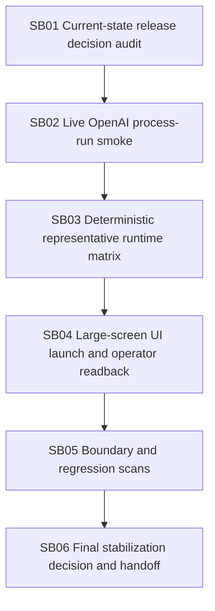

# Phase Plan

## Critical Subbundles
All subbundles are critical because this is a stabilization closure bundle.

## Phase Gates
Each subbundle must:
- make real source/test changes only if needed;
- keep proof concise;
- run focused validation;
- classify blockers honestly;
- avoid new process runtime extraction;
- avoid execution-capable driver behavior.
