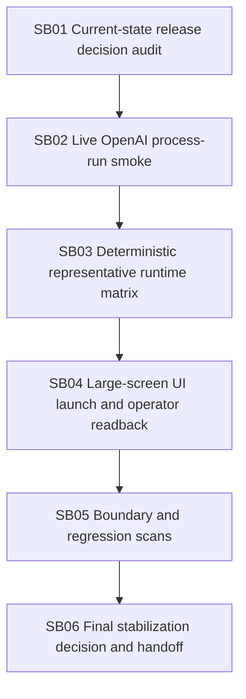

# Phase Plan

## Execution Order
- SB01 current-state release decision audit.
- SB02 live OpenAI process-run smoke with explicit bounded env.
- SB03 deterministic representative runtime matrix rerun.
- SB04 large-screen UI launch-to-completed-run and operator readback.
- SB05 boundary and regression scans.
- SB06 final stabilization decision and handoff.

## Subbundle Dependency Map

## Critical Subbundles
- SB01 is critical because downstream proof depends on an honest blocker taxonomy.
- SB02 is critical because live-provider status determines the final release class.
- SB03 is critical because deterministic process runtime proof determines functional stability.
- SB04 is critical because user-visible launch and operator readback must be rerun.
- SB05 is critical because architecture drift would invalidate stabilization closure.
- SB06 is critical because it reconciles all proof into the final decision.

## Phase Gates
- make real source/test changes only if needed;
- keep proof concise;
- run focused validation;
- classify blockers honestly;
- avoid new process runtime extraction;
- avoid execution-capable driver behavior.
- downstream subbundles may start only after the previous subbundle records entry and closure gate results or an honest blocker.
