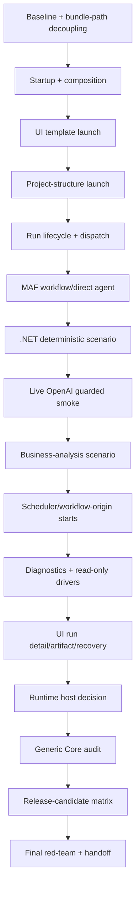

# Phase Plan

## Execution Order
- P01: SB001, SB002, SB003.
- P02: SB004, SB005, SB006.
- P03: SB007, SB008, SB009.
- P04: SB010, SB011, SB012.
- P05: SB013, SB014, SB015.
- P06: SB016, SB017, SB018.
- P07: SB019, SB020, SB021.
- P08: SB022, SB023, SB024.
- P09: SB025, SB026, SB027.
- P10: SB028, SB029, SB030.
- P11: SB031, SB032, SB033.
- P12: SB034, SB035, SB036.
- P13: SB037, SB038, SB039.
- P14: SB040, SB041, SB042.
- P15: SB043, SB044, SB045.
- P16: SB046, SB047, SB048.

## Subbundle Dependency Map

## Critical Subbundles

Critical gates: SB003, SB006, SB009, SB012, SB015, SB018, SB021, SB024, SB027, SB030, SB033, SB036, SB039, SB042, SB045, SB048.

Each critical gate must include:
- source assertions,
- semantic adequacy proof,
- adversarial negative proof,
- passing positive proof,
- anti-stub audit,
- no transient bundle-path test coupling,
- changed-file hashes,
- build/test/source scan transcripts.

## Phase Gates

| Phase | Subbundles | Gate |
| --- | --- | --- |
| P01 | SB001-SB003 | No long-lived test/source path reads from `codex/bundles/<bundle-name>`. |
| P02 | SB004-SB006 | App starts and process module composition is registered. |
| P03 | SB007-SB009 | Global Processes UI can start a run on large desktop. |
| P04 | SB010-SB012 | Project/project-structure process launch works with context. SB012 passed. |
| P05 | SB013-SB015 | Run lifecycle, dispatch, finalizer, artifacts proven. |
| P06 | SB016-SB018 | MAF workflow/direct-agent routes proven. |
| P07 | SB019-SB021 | Deterministic `.NET` scenario proven. |
| P08 | SB022-SB024 | Live OpenAI opt-in smoke proven or explicitly skipped with reason. |
| P09 | SB025-SB027 | Business-analysis scenario proven. |
| P10 | SB028-SB030 | Scheduler/workflow-origin starts proven through process services. |
| P11 | SB031-SB033 | Read-only driver diagnostics integrated without mutation. |
| P12 | SB034-SB036 | UI run detail/artifact/recovery surfaces proven. |
| P13 | SB037-SB039 | Runtime host status is source-backed and not accidentally implemented. |
| P14 | SB040-SB042 | Process Core remains generic. |
| P15 | SB043-SB045 | Release-candidate smoke matrix passes. |
| P16 | SB046-SB048 | Final red-team, validators, zip handoff. |
