# Phase Plan

## Phase Sequence
- Execute P01 through P20 in order; each phase gate must pass before the next phase starts.
- Within each phase, execute the three owned subbundles in numeric order.
- Critical subbundles every third subbundle close the phase and must include semantic adequacy proof before downstream phases continue.

## Subbundle Dependency Map

```mermaid
graph TD
  P01[P01: Baseline reconciliation and live-smoke readiness]
  P02[P02: Guarded live OpenAI smoke]
  P01 --> P02
  P03[P03: Live direct-agent process route]
  P02 --> P03
  P04[P04: Live/deterministic .NET and business scenario safety net]
  P03 --> P04
  P05[P05: Verification host contract alpha]
  P04 --> P05
  P06[P06: Explicit registry and selector alpha]
  P05 --> P06
  P07[P07: DI and composition for verification-only host]
  P06 --> P07
  P08[P08: Manager-readonly diagnostics command]
  P07 --> P08
  P09[P09: Manager command UI/API and evidence projection]
  P08 --> P09
  P10[P10: Immutable audit persistence boundary]
  P09 --> P10
  P11[P11: Audit retention/redaction/replay hardening]
  P10 --> P11
  P12[P12: Scheduler/workflow readiness without driver hooks]
  P11 --> P12
  P13[P13: Process runtime host observability and failure taxonomy]
  P12 --> P13
  P14[P14: Generic Process Core and domain leakage audit]
  P13 --> P14
  P15[P15: Execution-capable driver future gate]
  P14 --> P15
  P16[P16: Large-screen UI and manager diagnostics smoke]
  P15 --> P16
  P17[P17: Release-candidate full matrix]
  P16 --> P17
  P18[P18: Docs, operator runbook, and migration guide]
  P17 --> P18
  P19[P19: Final red-team and fake-proof resistance]
  P18 --> P19
  P20[P20: Completed validator and handoff]
  P19 --> P20
```

## Critical Subbundles

- **SB003** closes **P01: Baseline reconciliation and live-smoke readiness** and must include semantic adequacy proof, changed-file hashes, source assertions, command transcripts, anti-stub scan, and red-team/failing-negative proof where applicable.
- **SB006** closes **P02: Guarded live OpenAI smoke** and must include semantic adequacy proof, changed-file hashes, source assertions, command transcripts, anti-stub scan, and red-team/failing-negative proof where applicable.
- **SB009** closes **P03: Live direct-agent process route** and must include semantic adequacy proof, changed-file hashes, source assertions, command transcripts, anti-stub scan, and red-team/failing-negative proof where applicable.
- **SB012** closes **P04: Live/deterministic .NET and business scenario safety net** and must include semantic adequacy proof, changed-file hashes, source assertions, command transcripts, anti-stub scan, and red-team/failing-negative proof where applicable.
- **SB015** closes **P05: Verification host contract alpha** and must include semantic adequacy proof, changed-file hashes, source assertions, command transcripts, anti-stub scan, and red-team/failing-negative proof where applicable.
- **SB018** closes **P06: Explicit registry and selector alpha** and must include semantic adequacy proof, changed-file hashes, source assertions, command transcripts, anti-stub scan, and red-team/failing-negative proof where applicable.
- **SB021** closes **P07: DI and composition for verification-only host** and must include semantic adequacy proof, changed-file hashes, source assertions, command transcripts, anti-stub scan, and red-team/failing-negative proof where applicable.
- **SB024** closes **P08: Manager-readonly diagnostics command** and must include semantic adequacy proof, changed-file hashes, source assertions, command transcripts, anti-stub scan, and red-team/failing-negative proof where applicable.
- **SB027** closes **P09: Manager command UI/API and evidence projection** and must include semantic adequacy proof, changed-file hashes, source assertions, command transcripts, anti-stub scan, and red-team/failing-negative proof where applicable.
- **SB030** closes **P10: Immutable audit persistence boundary** and must include semantic adequacy proof, changed-file hashes, source assertions, command transcripts, anti-stub scan, and red-team/failing-negative proof where applicable.
- **SB033** closes **P11: Audit retention/redaction/replay hardening** and must include semantic adequacy proof, changed-file hashes, source assertions, command transcripts, anti-stub scan, and red-team/failing-negative proof where applicable.
- **SB036** closes **P12: Scheduler/workflow readiness without driver hooks** and must include semantic adequacy proof, changed-file hashes, source assertions, command transcripts, anti-stub scan, and red-team/failing-negative proof where applicable.
- **SB039** closes **P13: Process runtime host observability and failure taxonomy** and must include semantic adequacy proof, changed-file hashes, source assertions, command transcripts, anti-stub scan, and red-team/failing-negative proof where applicable.
- **SB042** closes **P14: Generic Process Core and domain leakage audit** and must include semantic adequacy proof, changed-file hashes, source assertions, command transcripts, anti-stub scan, and red-team/failing-negative proof where applicable.
- **SB045** closes **P15: Execution-capable driver future gate** and must include semantic adequacy proof, changed-file hashes, source assertions, command transcripts, anti-stub scan, and red-team/failing-negative proof where applicable.
- **SB048** closes **P16: Large-screen UI and manager diagnostics smoke** and must include semantic adequacy proof, changed-file hashes, source assertions, command transcripts, anti-stub scan, and red-team/failing-negative proof where applicable.
- **SB051** closes **P17: Release-candidate full matrix** and must include semantic adequacy proof, changed-file hashes, source assertions, command transcripts, anti-stub scan, and red-team/failing-negative proof where applicable.
- **SB054** closes **P18: Docs, operator runbook, and migration guide** and must include semantic adequacy proof, changed-file hashes, source assertions, command transcripts, anti-stub scan, and red-team/failing-negative proof where applicable.
- **SB057** closes **P19: Final red-team and fake-proof resistance** and must include semantic adequacy proof, changed-file hashes, source assertions, command transcripts, anti-stub scan, and red-team/failing-negative proof where applicable.
- **SB060** closes **P20: Completed validator and handoff** and must include semantic adequacy proof, changed-file hashes, source assertions, command transcripts, anti-stub scan, and red-team/failing-negative proof where applicable.

## Phase Gates

### P01 — Baseline reconciliation and live-smoke readiness
- Subbundles: SB001, SB002, SB003
- Closure gate: SB003 must pass before downstream phases continue.

### P02 — Guarded live OpenAI smoke
- Subbundles: SB004, SB005, SB006
- Closure gate: SB006 must pass before downstream phases continue.

### P03 — Live direct-agent process route
- Subbundles: SB007, SB008, SB009
- Closure gate: SB009 must pass before downstream phases continue.

### P04 — Live/deterministic .NET and business scenario safety net
- Subbundles: SB010, SB011, SB012
- Closure gate: SB012 must pass before downstream phases continue.

### P05 — Verification host contract alpha
- Subbundles: SB013, SB014, SB015
- Closure gate: SB015 must pass before downstream phases continue.

### P06 — Explicit registry and selector alpha
- Subbundles: SB016, SB017, SB018
- Closure gate: SB018 must pass before downstream phases continue.

### P07 — DI and composition for verification-only host
- Subbundles: SB019, SB020, SB021
- Closure gate: SB021 must pass before downstream phases continue.

### P08 — Manager-readonly diagnostics command
- Subbundles: SB022, SB023, SB024
- Closure gate: SB024 must pass before downstream phases continue.

### P09 — Manager command UI/API and evidence projection
- Subbundles: SB025, SB026, SB027
- Closure gate: SB027 must pass before downstream phases continue.

### P10 — Immutable audit persistence boundary
- Subbundles: SB028, SB029, SB030
- Closure gate: SB030 must pass before downstream phases continue.

### P11 — Audit retention/redaction/replay hardening
- Subbundles: SB031, SB032, SB033
- Closure gate: SB033 must pass before downstream phases continue.

### P12 — Scheduler/workflow readiness without driver hooks
- Subbundles: SB034, SB035, SB036
- Closure gate: SB036 must pass before downstream phases continue.

### P13 — Process runtime host observability and failure taxonomy
- Subbundles: SB037, SB038, SB039
- Closure gate: SB039 must pass before downstream phases continue.

### P14 — Generic Process Core and domain leakage audit
- Subbundles: SB040, SB041, SB042
- Closure gate: SB042 must pass before downstream phases continue.

### P15 — Execution-capable driver future gate
- Subbundles: SB043, SB044, SB045
- Closure gate: SB045 must pass before downstream phases continue.

### P16 — Large-screen UI and manager diagnostics smoke
- Subbundles: SB046, SB047, SB048
- Closure gate: SB048 must pass before downstream phases continue.

### P17 — Release-candidate full matrix
- Subbundles: SB049, SB050, SB051
- Closure gate: SB051 must pass before downstream phases continue.

### P18 — Docs, operator runbook, and migration guide
- Subbundles: SB052, SB053, SB054
- Closure gate: SB054 must pass before downstream phases continue.

### P19 — Final red-team and fake-proof resistance
- Subbundles: SB055, SB056, SB057
- Closure gate: SB057 must pass before downstream phases continue.

### P20 — Completed validator and handoff
- Subbundles: SB058, SB059, SB060
- Closure gate: SB060 must pass before downstream phases continue.
