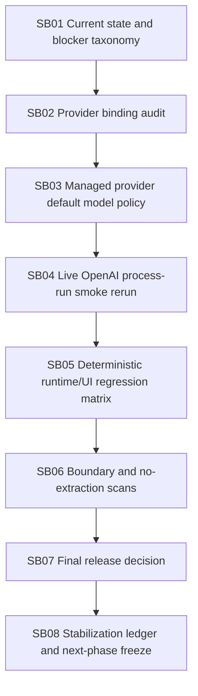

# Phase Plan

## Execution Order
- Execute SB01 through SB08 in sequence because each phase depends on the previous phase's proof and release classification.

## Subbundle Dependency Map

## Critical Subbundles
- SB01, SB02, SB03, SB04, SB05, SB06, SB07, and SB08 are critical.
- Each subbundle is intentionally a larger stabilization area, not a micro task.

## Phase Gates
Every subbundle must:
- prefer real `src`/`tests` changes only where behavior needs repair;
- keep proof concise;
- record exact commands and result classification;
- avoid runtime-core extraction;
- avoid execution-capable drivers;
- avoid direct provider bypasses;
- update release classification honestly.

## Browser Validation
Use large desktop only for UI proof. Reuse the existing project/project-structure launch-to-completed-run Playwright proof unless a UI change is made.

## Final Validation Matrix
- `dotnet build CanDoItAll.slnx --configuration Debug --no-restore`
- Full unit tests.
- Focused deterministic process runtime integration matrix.
- Large-desktop Playwright project/project-structure launch-to-completed-run proof.
- Live OpenAI process-run smoke with managed provider default model or explicit accepted override.
- Boundary scans: Process Core leakage, driver runtime drift, scheduler/workflow driver hook drift, direct provider bypass, secret leakage.
