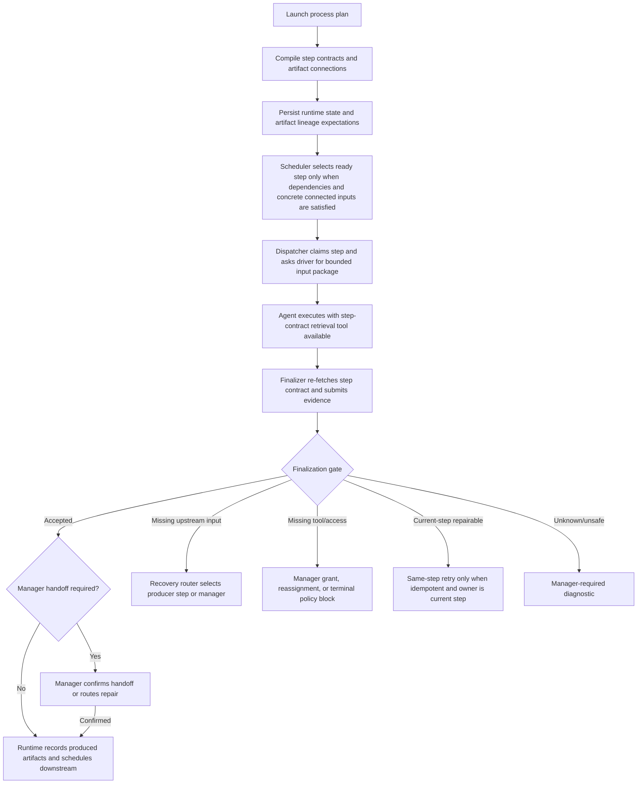

# Target Solution

## Target End State

The process runtime advances steps only from typed runtime facts:

- step contract: durable instruction, required inputs, expected outputs, branch outcomes, tool receipts, driver policy, and handoff rule;
- artifact lineage: concrete producer step, artifact slot, artifact instance, storage/read reference, content hash, connection path, sensitivity, and consumer step;
- finalization result: verified required input inspection, required output production, required receipt presence, branch decision, and manager handoff requirement;
- recovery decision: typed owner and action for current-step retry, upstream repair, manager access/reassignment, child-run propagation, or terminal block.

The runtime remains generic. It understands processes, steps, artifacts, contracts, finalization, handoff, manager decisions, retry safety, and driver hooks. It does not understand .NET projects, browsers, pull requests, build systems, project-structure nodes, MAF agents, or software-delivery process semantics.

## Proposed Runtime Boundary

Runtime owns:

- immutable runtime plan interpretation;
- step state transitions;
- artifact lineage ledger;
- step contract projection from runtime state;
- finalization gate evaluation for generic requirements;
- recovery taxonomy and routing decisions;
- manager-handoff state transitions;
- retry eligibility for generic failure classes.

Runtime must not reference Application, Persistence, Modules, AgentFramework, MAF, Blazor, project-structure services, browser tooling, or .NET-delivery concepts.

## Proposed Application Boundary

Application owns:

- launch orchestration;
- persistence transaction boundaries;
- dispatch coordination;
- manager-control orchestration;
- projection/query composition;
- dependency injection assembly for process services.

Application may depend on Runtime and Core. It should not become the home of domain-specific software-development policy. That belongs in templates or drivers.

## Proposed Driver Boundary

Process drivers own:

- domain-specific evidence policies;
- adapter-specific tool receipt interpretation;
- context packaging policies;
- finalizer prompt/tool integration details;
- subprocess-specific integration rules;
- domain-specific recovery advice.

Drivers return typed generic results to runtime. Driver policy cannot silently downgrade missing artifacts or denied tools into safe retries.

## Proposed Module Boundary

`CanDoItAll.Modules.Processes` owns host integration:

- AgentFramework execution adapter;
- tool registration and dispatch integration;
- UI-facing services and projections;
- MAF-specific receipts and managed artifact materialization.

Module integration should become thinner. Large partial classes should delegate to cohesive runtime-neutral or driver-specific services with independently testable contracts.

## Core Contracts To Introduce Or Harden

- `ProcessStepContract`: durable contract for a step instance, including instructions, required artifact slots, expected output slots, finalization rules, required capability receipts, branch outcomes, and manager handoff rules.
- `ProcessStepInputArtifact`: concrete connected input artifact for a consumer step, including source step, source slot, artifact reference, connection id/path, storage/read reference, hash, sensitivity, and availability state.
- `ProcessStepInputPackage`: bounded package of connected artifacts, summaries, retrieval handles, and context budget metadata for a step.
- `ProcessFinalizationRequirement`: typed requirements evaluated before completion and before downstream scheduling.
- `ProcessFinalizationResult`: accepted, repairable current-step issue, upstream-input issue, manager-required issue, or terminal issue.
- `ProcessRecoveryRoute`: responsible owner and action: current step retry, upstream step rework, manager access grant/reassignment, child-run propagation, template/plan invalid, or terminal.
- `ProcessManagerHandoffState`: explicit state between finalization and downstream readiness when manager confirmation is required.

Names are illustrative. Implementation must follow existing naming patterns and avoid unnecessary interfaces when a record/value object is enough.

## Target Flow

## Allowed Side Effects

- New strongly typed contracts in Core/Runtime/Driver Abstractions.
- Runtime service extraction from partial classes where behavior becomes independently testable.
- Persistence schema additions for artifact lineage, input packages, finalization receipts, recovery routes, and handoff state.
- Projection updates so operators can inspect why a step is blocked, retryable, waiting for manager handoff, or routed to upstream repair.
- Adapter decomposition in Module integration so AgentFramework policy and managed artifact handling are testable without expanding the current partial clusters.

## Disallowed Side Effects

- No domain-specific `.NET`, project, browser, GitHub, or MAF concepts in generic runtime contracts.
- No new silent fallback path for missing artifacts, access, receipts, or proof.
- No automatic retry for missing connected inputs, denied tools, missing manager handoff, invalid template connections, or unknown failure classes.
- No final design that relies on adding more `ProcessRuntimeEngine.*.cs` or `AgentFrameworkProcessExecutionAdapter.*.cs` partial files without extracting responsibilities.
