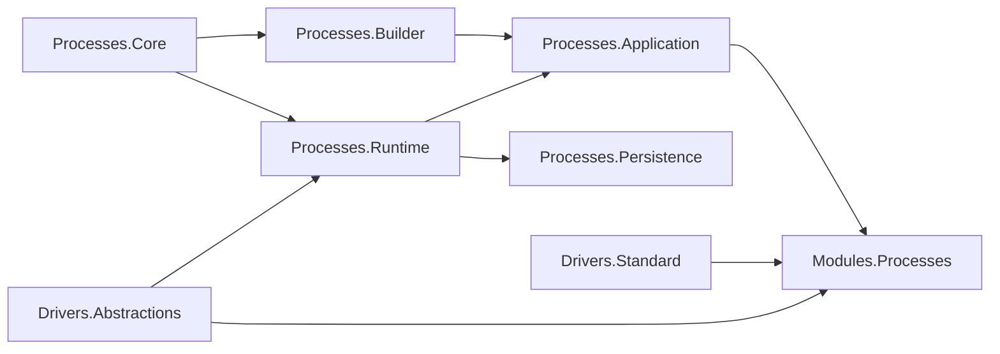

# C# Dependency Direction

## Current Direction From CodeAnalytics

- Scoped graph has no project cycles.
- Strong edge: `CanDoItAll.Processes.Application` depends on `CanDoItAll.Processes.Runtime`.
- Persistence currently depends on Runtime for persisted runtime-state models.
- Module integration depends broadly on process projects and owns AgentFramework-specific adapter behavior.

## Required Direction After Refactor

The diagram is logical ownership, not a literal compile graph for every existing edge. Implementation must keep the compile graph acyclic and must not introduce reverse dependencies from Runtime to Application, Persistence, Modules, UI, AgentFramework, or software-development packages.

## Compile-Time Guardrails

- New artifact lineage and finalization value objects should prefer Core when they are pure definitions, Runtime when they are runtime-state facts, and Driver Abstractions when they define extension points.
- Runtime service extraction must remain internal or runtime-owned unless an external project has a real need.
- Persistence schema changes must map runtime-owned state without moving decision behavior into persistence.
- Driver abstractions must be narrow and semantic. Avoid generic service-locator APIs or stringly typed policy names.
- Module integration must consume driver/runtime contracts rather than adding runtime callbacks into AgentFramework code.

## Dependency Regression Checks

- Run CodeAnalytics dependencies after implementation and confirm no new cycles.
- Add source assertions in SB08 that Runtime does not reference Module, AgentFramework, MAF, Blazor, project-structure, browser, GitHub, or .NET-delivery namespaces.
- Add source assertions that no new partial file is added to the two current partial clusters unless paired with an extraction-removal plan and closure note.
