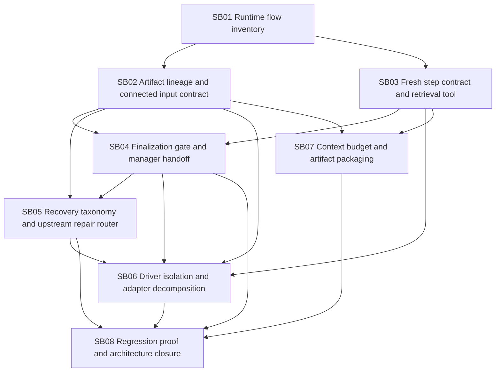

# Phase Plan

## Phase Sequence

1. SB01 inventories runtime flow and locks characterization tests before behavior changes.
2. SB02 introduces connected artifact lineage and concrete input packages.
3. SB03 exposes durable step-contract retrieval for agents and finalizers.
4. SB04 adds finalization and manager handoff gates using SB02/SB03 facts.
5. SB05 replaces retry heuristics with recovery taxonomy and upstream repair routing.
6. SB06 decomposes driver/adapter responsibilities and prevents generic-runtime domain leakage.
7. SB07 bounds downstream context packages and artifact retrieval.
8. SB08 performs regression proof, architecture closure, and raw-note closure.

## Subbundle Dependency Map

## Critical Subbundles

- SB01 is critical because later proof is invalid without source-characterized flows and failing-edge scenarios.
- SB02 is critical because downstream finalization and repair routing are impossible without concrete connected artifact lineage.
- SB03 is critical because context-loss recovery requires fresh contract retrieval from durable runtime state.
- SB04 is critical because process advancement must be blocked before the next step sees incomplete input.
- SB05 is critical because retry and repair routing define the hardening behavior the user explicitly requested.
- SB06 is critical because the architecture goal requires real isolation, not additional partial-class spread.
- SB08 is critical closure because fake-positive tests can otherwise miss the actual runtime edges.

## Phase Gates

- Preparation gate: run `python codex\skills\bundles\candoitall-bundle-preparation\scripts\validate_bundle.py codex\bundles\process-runtime-recovery-finalization-hardening --profile initiative --stage prepared --repo-root .` and repair failures.
- SB01 exit gate: execution report contains current flow map, source refs, characterization tests, and confirmed current retry/finalization gaps.
- SB02 exit gate: concrete artifact lineage exists through production launch/plan paths and tests cover non-direct connected producer artifact flow.
- SB03 exit gate: a step agent/finalizer can re-fetch the durable current step contract and input package with authorization and sensitivity handling.
- SB04 exit gate: a step cannot complete or make consumers ready until finalization and required manager handoff pass.
- SB05 exit gate: missing input/tool/access routes to upstream repair or manager, while same-step retry is limited to proven current-step transient/idempotent failures.
- SB06 exit gate: generic runtime remains domain-neutral, driver policies are isolated, and partial-cluster source assertions pass.
- SB07 exit gate: downstream context uses bounded packages and retrieval handles by default.
- SB08 closure gate: all proof manifests are complete, CodeAnalytics dependency refresh is clean, raw notes are closed, and architecture gate passes.

## Browser Validation

Most work is backend/runtime architecture. Browser validation is required only when implementation changes process UI, projections, or host-visible manager recovery screens. SB08 must explicitly record either concrete browser evidence or `N/A - no browser-visible changes` with rationale.
