# Phase Plan

## Execution Order

- Execute subbundles in numeric order from SB001 through SB054 unless a prerequisite gate fails and reopens earlier work.
- Critical gates occur every third subbundle and must pass before dependent phases continue.

## Subbundle Dependency Map

```mermaid
graph TD
  P01[P01: Crash/source reconciliation and bundle-path test contamination inventory]
  P02[P02: Remove bundle-path coupling from tests]
  P01 --> P02
  P03[P03: Application startup and composition baseline]
  P02 --> P03
  P04[P04: Process UI route and template catalog inventory]
  P03 --> P04
  P05[P05: UI process-start E2E skeleton]
  P04 --> P05
  P06[P06: Process run creation and persistence]
  P05 --> P06
  P07[P07: Dispatch/claim/route/finalizer runtime restoration]
  P06 --> P07
  P08[P08: MAF/workflow/direct-agent execution compatibility]
  P07 --> P08
  P09[P09: .NET software-development scenario]
  P08 --> P09
  P10[P10: Generic business-analysis scenario]
  P09 --> P10
  P11[P11: Read-only driver verification in process manager path]
  P10 --> P11
  P12[P12: Process-level read-only orchestration hardening]
  P11 --> P12
  P13[P13: Scheduler and workflow launch readiness]
  P12 --> P13
  P14[P14: Runtime host roadmap decision]
  P13 --> P14
  P15[P15: Process Core genericity audit]
  P14 --> P15
  P16[P16: Release candidate smoke matrix]
  P15 --> P16
  P17[P17: Docs and operator handoff]
  P16 --> P17
  P18[P18: Final red-team and validators]
  P17 --> P18
```

## Critical Subbundles

Critical gates are every third subbundle:

- SB003
- SB006
- SB009
- SB012
- SB015
- SB018
- SB021
- SB024
- SB027
- SB030
- SB033
- SB036
- SB039
- SB042
- SB045
- SB048
- SB051
- SB054

## Phase Gates

### P01 — Crash/source reconciliation and bundle-path test contamination inventory

- SB001 Re-read current branch, latest commit, latest execution report, and source hotspots.
- SB002 Inventory every test/source reference to `codex/bundles/` and classify stable vs transient.
- SB003 Gate A: source-backed current-state proof; no report-only closure.

### P02 — Remove bundle-path coupling from tests

- SB004 Replace bundle-file architecture assertions with source-backed architecture assertions.
- SB005 Move any required durable fixture text to `tests/TestData/Architecture` or stable docs, not `codex/bundles`.
- SB006 Gate B: full unit proof that tests no longer require transient bundle folders.

### P03 — Application startup and composition baseline

- SB007 Inventory web app startup path, composition registration, database/test configuration, and process module registration.
- SB008 Add or repair deterministic app-start smoke test / host startup proof.
- SB009 Gate C: app starts with current branch and no missing DI/project references.

### P04 — Process UI route and template catalog inventory

- SB010 Inventory large-screen process UI routes, project/project-structure launch entry points, and process template catalog.
- SB011 Add source/API tests that required process templates are registered and visible to UI/API layers.
- SB012 Gate D: process template catalog and UI launch affordance map are source-backed.

### P05 — UI process-start E2E skeleton

- SB013 Add large-screen Playwright/app test route proof for process page or project context.
- SB014 Add UI/API proof that user can select a process template and create a run.
- SB015 Gate E: UI process-start smoke passes; no small/medium/mobile proof.

### P06 — Process run creation and persistence

- SB016 Verify run/step creation persistence, statuses, process-run ownership, project association, and input payload persistence.
- SB017 Add regression tests for invalid templates, missing project context, and duplicate/unsafe start attempts.
- SB018 Gate F: process run creation is reliable and generic.

### P07 — Dispatch/claim/route/finalizer runtime restoration

- SB019 Verify dispatcher can find eligible run/step and acquire claim.
- SB020 Verify route execution, finalizer, state transition, and artifact validation paths still work with deterministic/fake executor.
- SB021 Gate G: dispatch advances a process run without read-only driver mutation.

### P08 — MAF/workflow/direct-agent execution compatibility

- SB022 Inventory current MAF workflow/direct-agent executor integration and fake-provider options.
- SB023 Add focused runtime tests for workflow-backed role and direct-agent route using deterministic/fake execution.
- SB024 Gate H: MAF/process integration is not broken by Core/driver refactors.

### P09 — .NET software-development scenario

- SB025 Define deterministic `.NET app create` scenario input/output expectations and fake-agent strategy.
- SB026 Run process through create/modify scenario and assert artifacts/files/evidence/status.
- SB027 Gate I: software-development process scenario produces concrete output and closes cleanly.

### P10 — Generic business-analysis scenario

- SB028 Define business-analysis process template/scenario independent of software-development domain terms.
- SB029 Run business-analysis scenario and assert analysis artifact/evidence/status.
- SB030 Gate J: generic process core supports non-software-development scenario.

### P11 — Read-only driver verification in process manager path

- SB031 Add process-manager diagnostic observation using supplied evidence only; no transition/finalizer mutation.
- SB032 Attach verification observations as diagnostics or read-only evidence envelope only when explicitly requested.
- SB033 Gate K: driver observations help verification but cannot mutate process state.

### P12 — Process-level read-only orchestration hardening

- SB034 Split remaining large read-only orchestration files where necessary and enforce lane-specific builders/adapters.
- SB035 Add cross-lane no-mutation/audit/redaction/evidence hash tests at process level.
- SB036 Gate L: read-only orchestration remains bounded and maintainable.

### P13 — Scheduler and workflow launch readiness

- SB037 Inventory existing scheduler/planner/workflow trigger hooks for processes, not drivers.
- SB038 Add safe test-only/manual process trigger path for scheduled or workflow-initiated process start.
- SB039 Gate M: scheduler/workflow launch readiness documented and tested without generic driver runtime.

### P14 — Runtime host roadmap decision

- SB040 Re-evaluate whether a read-only driver host is now safe after UI/process runtime proof.
- SB041 Keep runtime host not-approved unless all prerequisites are source-backed; document exact future approval gate.
- SB042 Gate N: no runtime host/registry/selector/DI/manager command sneaks in.

### P15 — Process Core genericity audit

- SB043 Scan generic Core/runtime for `.NET`, software-only, Office-only, business-only domain leakage.
- SB044 Move domain-specific logic into domain templates/drivers/adapters; keep Core/process runtime generic.
- SB045 Gate O: generic process core boundary remains clean.

### P16 — Release candidate smoke matrix

- SB046 Run solution build, full unit, focused integration, Playwright large-screen UI process-start, and scenario smoke matrix.
- SB047 Run source scans for bundle-path coupling, runtime-host drift, Core reverse dependency, driver mutation, UI/media drift.
- SB048 Gate P: release-candidate matrix passes.

### P17 — Docs and operator handoff

- SB049 Update stable docs for how to launch processes from UI/API and what is currently supported.
- SB050 Update driver/Core/process runtime roadmap with ready/blocked/future gates.
- SB051 Gate Q: docs match source and do not imply unsupported runtime host capabilities.

### P18 — Final red-team and validators

- SB052 Run red-team fake-proof audit: reject report-only, table-only, non-empty-output-only, happy-path-only closure.
- SB053 Run prepared/completed validators and record raw-note closure.
- SB054 Gate R: final handoff zip, proof index, and reopen triggers completed.

