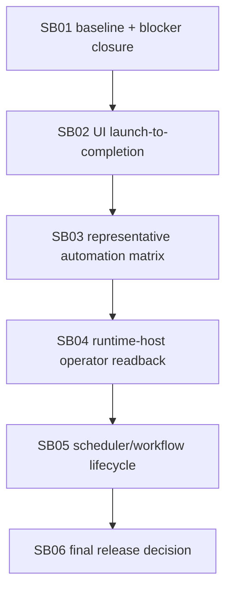

# Phase Plan

## Execution Order
1. SB01: Baseline reconciliation and previous blocker closure.
2. SB02: UI project/project-structure launch-to-completed-run proof.
3. SB03: Representative template automation regression hardening.
4. SB04: Runtime-host operator readback closure.
5. SB05: Scheduler/workflow process-owned lifecycle closure.
6. SB06: Final release matrix, live smoke classification, and merge decision.

## Subbundle Dependency Map



## Critical Subbundles
- SB01 is critical because stale baseline or ratio proof invalidates final release closure.
- SB02 is critical because downstream release proof needs real user-visible launch-to-completed-run evidence.
- SB03 is critical because representative backend automation is the runtime baseline.
- SB04 is critical because runtime-host readback is an explicit remaining release gap.
- SB05 is critical because scheduler/workflow-origin starts must stay process-owned.
- SB06 is critical because it closes the release matrix and merge decision.

## Phase Gates
- SB01 must pass before SB02 starts: explicit bundle-start SHA, ratio guard, previous blocker classification, and no stale-baseline fallback.
- SB02 must pass before SB03 starts: large-desktop Playwright launch-to-completed-run proof with screenshots and API readback.
- SB03 must pass before SB04 starts: representative automation matrix green and manual-transition tests classified as non-automation proof.
- SB04 must pass before SB05 starts: runtime-host readback proof covers real run/step ids and required diagnostic fields.
- SB05 must pass before SB06 starts: scheduler/workflow lifecycle proof uses process-owned services and read-only verification remains non-mutating.
- SB06 must not close unless build, focused tests, browser proof, scans, ratio, live-smoke classification, raw-note closure, and final validator agree.

## Code-first rule
Final closure is blocked unless:

```text
(src + tests changed lines) >= 5 × codex/bundles changed lines
```

Docs do not count as implementation. The ratio baseline must be an explicit SHA captured at the start of execution, not `HEAD`, branch names, or an older bundle baseline.

## Proof discipline
Each subbundle should add concise evidence only. Do not create large proof directory trees. Prefer focused test names, source assertions, and one short manifest update per critical phase.
