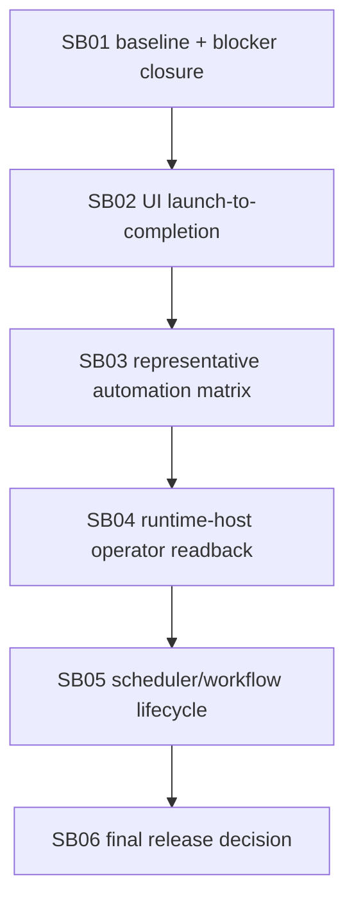

# Phase Plan

## Execution order
1. SB01: Baseline reconciliation and previous blocker closure.
2. SB02: UI project/project-structure launch-to-completed-run proof.
3. SB03: Representative template automation regression hardening.
4. SB04: Runtime-host operator readback closure.
5. SB05: Scheduler/workflow process-owned lifecycle closure.
6. SB06: Final release matrix, live smoke classification, and merge decision.

## Subbundle Dependency Map



## Critical subbundles
All six subbundles are critical. They are intentionally large implementation areas rather than micro-edits.

## Code-first rule
Final closure is blocked unless:

```text
(src + tests changed lines) >= 5 × codex/bundles changed lines
```

Docs do not count as implementation. The ratio baseline must be an explicit SHA captured at the start of execution, not `HEAD`, branch names, or an older bundle baseline.

## Proof discipline
Each subbundle should add concise evidence only. Do not create large proof directory trees. Prefer focused test names, source assertions, and one short manifest update per critical phase.
