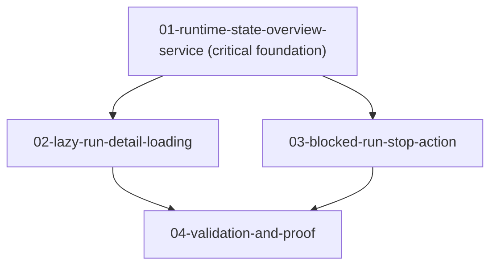

# Phase Plan

## Phase Sequence

1. Prepare and validate this bundle.
2. Implement `01-runtime-state-overview-service` as the critical foundation.
3. Implement `02-lazy-run-detail-loading` after the state service is proven.
4. Implement `03-blocked-run-stop-action` after lazy loading is stable.
5. Run `04-validation-and-proof`, update execution evidence, and close raw notes.

## Subbundle Dependency Map

## Critical Subbundles

- `01-runtime-state-overview-service` is a critical foundation. If its counts or cache boundaries are wrong, all later UI badge, lazy-loading, and future Manager-agent surfaces inherit bad state.
- `02-lazy-run-detail-loading` is a critical UI foundation. If first-page load still fetches full details, the performance requirement remains unsolved.

## Phase Gates

- Gate after preparation: run `validate_bundle.py --stage prepared` and manually confirm coverage.
- Gate after subbundle 01: integration test or equivalent focused proof shows active, blocked, and failed counts are separated and source-of-truth remains in existing runtime persistence.
- Gate after subbundle 02: code/test proof shows full selected-run details are not loaded unless Runs tab or `runId` requires them.
- Gate after subbundle 03: integration test shows only blocked runs can be stopped and stopped runs become `Cancelled` with journal evidence.
- Gate before closure: run targeted tests/build, perform browser proof or record blocker, close every raw note, then run completed validator.
