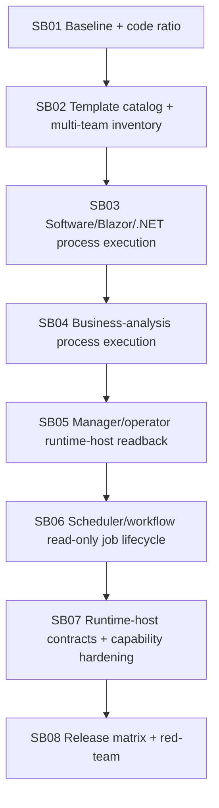

# Phase Plan

## Execution Order
- SB01 establishes the code-first baseline and source inventory.
- SB02 verifies or repairs template catalog availability.
- SB03 proves software/Blazor/.NET process execution from project context.
- SB04 proves non-software business-analysis execution.
- SB05 ties runtime-host dry-run readback to real run/operator context.
- SB06 adds scheduler/workflow read-only verification job lifecycle proof.
- SB07 hardens contracts and capability boundaries.
- SB08 runs the release matrix and final red-team closure.

## Subbundle Dependency Map



## Critical Subbundles
- All subbundles are critical. There are only 8 because each should own a larger coherent implementation area.
- SB01 and SB02 are critical foundations; weak inventory or missing catalog proof invalidates later execution proof.
- SB03 through SB06 are critical production-path proof phases for runtime execution, readback, and job lifecycle.
- SB07 and SB08 are critical hardening and closure phases.

## Phase Gates
- Every subbundle must include:

- real `src` or `tests` changes unless it closes an explicit inventory blocker;
- focused tests or browser/API proof;
- source scans for Core leakage and forbidden driver runtime side effects;
- concise proof in the execution report, not huge generated proof trees;
- downstream impact decision.
- Do not start a dependent subbundle until the previous closure gate passes or records an explicit blocker.

## Final code-first ratio gate
Final closure is blocked unless:

```text
(src + tests changed lines) >= 4 × codex/bundles changed lines
```

Docs are reported separately and do not count as implementation.

## Final validation matrix
- `dotnet build CanDoItAll.slnx --configuration Debug --no-restore`
- `dotnet test tests/CanDoItAll.Tests.Unit/CanDoItAll.Tests.Unit.csproj --configuration Debug --no-build`
- focused integration matrix for process templates, software process, business-analysis process, runtime-host readback, scheduler/workflow job lifecycle, and driver boundaries
- Playwright large-screen smoke for UI/project/project-structure process launch if UI routes/components are touched or if route proof is needed
- optional live OpenAI process-run smoke only when explicit opt-in variables are present
- source scans for Process Core dependency drift, reflection discovery, fallback selector, driver self-registration, side-effect APIs, secret leakage, bundle-path coupling, and large file growth
