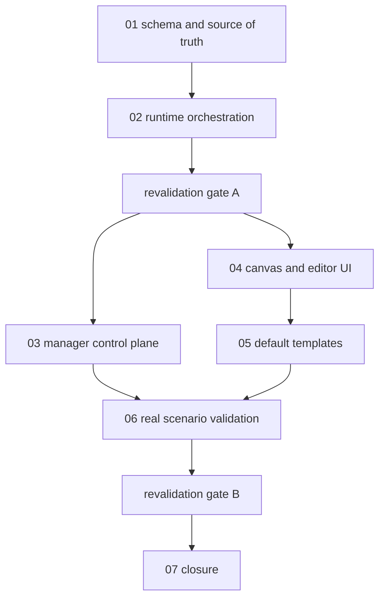

# Phase Plan

## Phase Sequence

1. Prepare schema/source-of-truth changes and migrations.
2. Implement runtime subprocess orchestration and status synchronization.
3. Revalidate architecture before manager and UI work.
4. Add manager override, reporting, and instructions.
5. Add canvas/editor support and browser validation.
6. Add default subprocess templates and template import support.
7. Run unit, component, integration, and real-world scenario validation.
8. Perform final architecture revalidation and closure review.

## Subbundle Dependency Map

## Critical Subbundles

- `01-architecture-source-of-truth-and-schema`: critical foundation. Later runtime, UI, templates, and tests all depend on the model contract.
- `02-runtime-subprocess-orchestration`: critical foundation. Manager reports and UI projections are invalid if child run creation is not idempotent.
- `04-canvas-and-editor-ui`: critical UI foundation. Browser proof is required before template/UI closure.
- `06-validation-real-world-scenarios`: process-critical closure. This must prove subprocesses alone and inside parent processes.

## Phase Gates

- Gate after preparation: run the bundle validator and repair failures.
- Gate before each subbundle: run subbundle validator entry review and confirm prerequisites.
- Gate after subbundle 02: inspect architecture for source-of-truth drift and refactor if any duplicate state ownership appears.
- Gate after subbundle 04: perform browser proof and screenshot review before templates depend on the UI.
- Gate after subbundle 06: rerun targeted build/tests and real scenario proof.
- Gate before closure: run final bundle validator, close raw notes, and reopen anything with weak proof.
