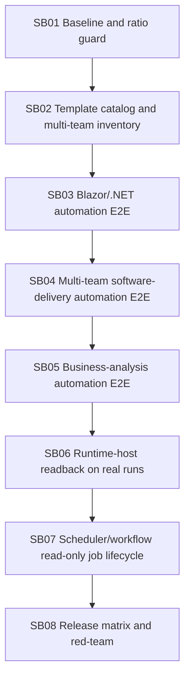

# Phase Plan

## Subbundle Dependency Map

## Critical Subbundles
All 8 subbundles are critical. They are intentionally larger implementation areas.

## Phase Gates
Each subbundle must record:
- source/test files changed,
- focused validation commands,
- semantic positive proof,
- adversarial negative proof,
- source scans for Core leakage and driver/runtime side effects,
- downstream progression decision.

## Final Validation Matrix
- Build.
- Full unit tests.
- Focused integration tests for templates, automation dispatch, scheduler/workflow verification jobs, runtime-host readback, and Core boundaries.
- Large desktop Playwright proof when UI/project-structure route is part of the subbundle.
- Optional live OpenAI process-run smoke only when opt-in variables are explicit.
- Code-first ratio gate.
