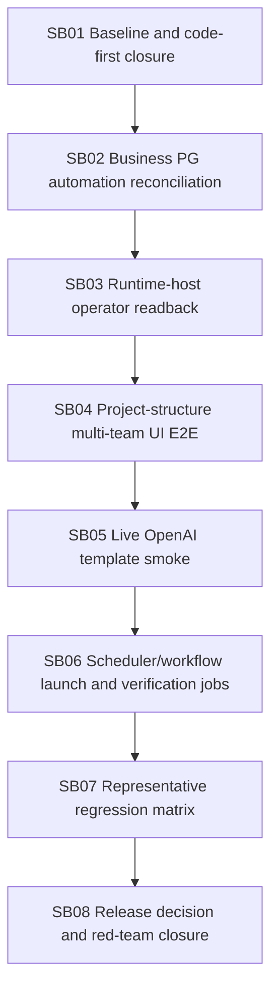

# Phase plan

## Subbundle dependency map

## Critical subbundles
All subbundles are critical. They are larger implementation areas, not micro-edits.

## Code-first gate
SB08 must run:
`git diff --numstat <explicit-start-sha>...HEAD`

Group changed lines:
- `src/`
- `tests/`
- `docs/`
- `codex/bundles/`

Final closure requires:
- `(src + tests changed lines) >= 5 × codex/bundles changed lines`
- docs are reported separately and do not count as implementation
- no generated per-SB proof trees beyond concise transcripts and execution report updates

## Browser validation
Large desktop only. Required for SB03 if UI route/component changes and SB04 project/project-structure launch. No mobile/small/medium proof.
