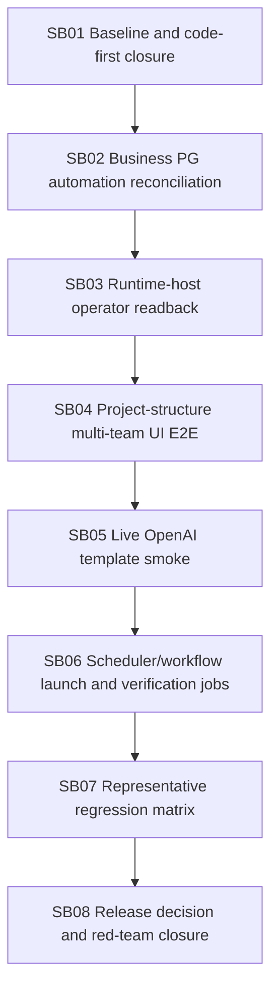

# Phase plan

## Execution Order
- SB01 baseline and source-truth gate.
- SB02 business PostgreSQL automation reconciliation.
- SB03 runtime-host operator readback.
- SB04 project-structure multi-team UI E2E.
- SB05 live OpenAI template smoke classification.
- SB06 scheduler/workflow trigger and read-only verification lifecycle.
- SB07 representative regression matrix.
- SB08 release decision and red-team closure.

## Subbundle Dependency Map

## Critical Subbundles
- SB01 through SB08 are critical subbundles.
- They are larger implementation areas, not micro-edits.

## Phase Gates
- Each subbundle must pass entry validation before code changes.
- Each subbundle must record artifact-backed proof and closure validation before downstream work starts.
- SB03, SB04, and SB07 require large desktop UI proof when UI behavior is touched or revalidated.
- SB08 cannot close unless the explicit start-SHA code-first ratio, build, tests, source scans, and raw-note closure all pass.

## Code-first gate
SB08 must run:
`git diff --numstat <explicit-start-sha>...HEAD`

Group changed lines:
- `src/`
- `tests/`
- `docs/`
- `codex/bundles/`

Final closure requires:
- `(src + tests changed lines) >= 5 × codex/bundles changed lines`
- docs are reported separately and do not count as implementation
- no generated per-SB proof trees beyond concise transcripts and execution report updates

## Browser validation
Large desktop only. Required for SB03 if UI route/component changes and SB04 project/project-structure launch. No mobile/small/medium proof.
