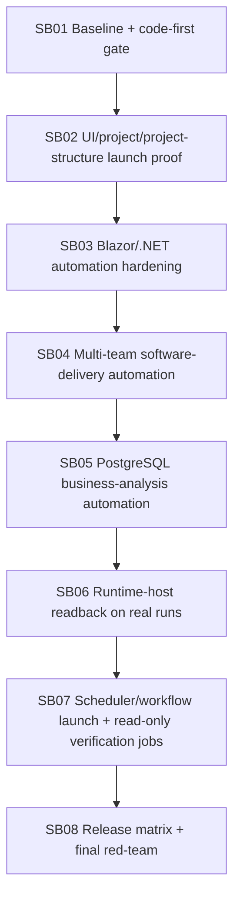

# Phase Plan

## Execution Order
- SB01 establishes the diff and proof baseline before any implementation-heavy phase.
- SB02 proves the user-visible project/project-structure launch path.
- SB03 hardens Blazor/.NET automation dispatch before broader representative templates.
- SB04 proves the software-delivery multi-team representative path.
- SB05 proves non-software business-analysis automation on PostgreSQL.
- SB06 attaches runtime-host readback to real representative runs.
- SB07 proves scheduler/workflow launch and read-only verification jobs without driver hooks.
- SB08 runs release validation, red-team scans, live opt-in classification, ratio check, and zip closure.

## Subbundle Dependency Map



## Critical Subbundles

- SB01 is critical because downstream code-first closure depends on its ratio and source-scan gates.
- SB02 is critical because user-facing launch confidence cannot be inferred from API-only proof.
- SB03 is critical because downstream representative template proof depends on production-path automation dispatch.
- SB04 is critical because the raw request names multi-team development and this bundle treats `software-delivery` as the canonical representative unless evidence says otherwise.
- SB05 is critical because business-analysis must be PostgreSQL-backed and free of software-domain leakage.
- SB06 is critical because runtime-host readback must attach to real run and step identities without mutation side effects.
- SB07 is critical because scheduler/workflow origins must use process-owned launch paths without driver hooks.
- SB08 is critical because final release confidence depends on full validation, red-team scans, browser proof, and the code-first ratio.

## Phase Gates

Each subbundle must include:

- real `src` or `tests` changes unless explicitly closed as a pure validation subbundle,
- focused tests or browser proof,
- source scans for Core leakage and forbidden runtime-host side effects,
- concise proof in the execution report,
- downstream impact decision.

## Final code-first ratio gate

Final closure is blocked unless:

```text
(src + tests changed lines) >= 5 × codex/bundles changed lines
```

Docs do not count as implementation. Screenshots/proofs do not count as implementation.

## Final validation matrix

- Build: `dotnet build CanDoItAll.slnx --configuration Debug --no-restore`
- Unit: full unit project
- Integration: representative template automation, business-analysis PostgreSQL automation, runtime-host readback, scheduler/workflow read-only job lifecycle
- Playwright: large-screen UI launch and run detail readback
- Optional live: one bounded OpenAI process-template smoke if explicit env variables are present
- Source scans: Core dependency drift, driver self-registration/reflection, fallback selector, mutation APIs, secret leakage, bundle-path coupling, large-file growth
