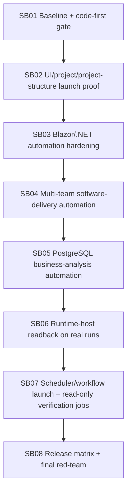

# Phase Plan

## Subbundle Dependency Map



## Critical Subbundles

All subbundles are critical and intentionally larger implementation areas. The implementation agent must not split these into proof-only micro edits.

## Phase Gates

Each subbundle must include:

- real `src` or `tests` changes unless explicitly closed as a pure validation subbundle,
- focused tests or browser proof,
- source scans for Core leakage and forbidden runtime-host side effects,
- concise proof in the execution report,
- downstream impact decision.

## Final code-first ratio gate

Final closure is blocked unless:

```text
(src + tests changed lines) >= 5 × codex/bundles changed lines
```

Docs do not count as implementation. Screenshots/proofs do not count as implementation.

## Final validation matrix

- Build: `dotnet build CanDoItAll.slnx --configuration Debug --no-restore`
- Unit: full unit project
- Integration: representative template automation, business-analysis PostgreSQL automation, runtime-host readback, scheduler/workflow read-only job lifecycle
- Playwright: large-screen UI launch and run detail readback
- Optional live: one bounded OpenAI process-template smoke if explicit env variables are present
- Source scans: Core dependency drift, driver self-registration/reflection, fallback selector, mutation APIs, secret leakage, bundle-path coupling, large-file growth
