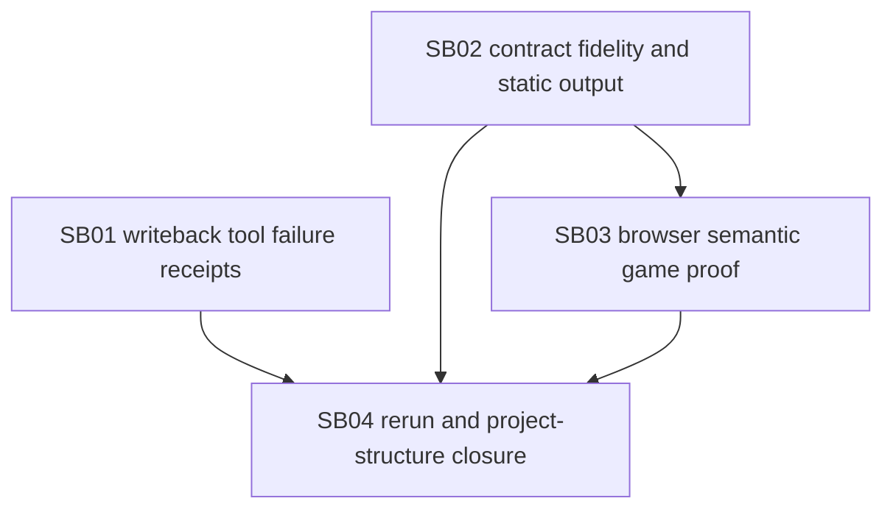

# Phase Plan

## Phase Sequence

1. `SB01 01-writeback-tool-failure-receipts`: make project-structure tool failures auditable and recoverable.
2. `SB02 02-contract-fidelity-and-static-output`: enforce the upstream static/WASM contract and product root through implementation and validation.
3. `SB03 03-browser-semantic-game-proof`: strengthen browser proof so non-interactive games fail.
4. `SB04 04-rerun-and-project-structure-closure`: rerun/repair Tetris delivery and prove full process closure.

## Subbundle Dependency Map

## Critical Subbundles

- `SB01` is a critical foundation because no final run can close if real `project_structure_asset_create` failures remain invisible to the runtime.
- `SB02` is a critical foundation because every downstream app-quality proof is invalid if the implementation is allowed to switch from static/WASM to a server-hosted shadow root.
- `SB03` is a critical foundation because the prior validation accepted a rendered but non-interactive game.
- `SB04` is final closure and cannot begin until SB01-SB03 gates pass.

## Phase Gates

- Preparation gate: `validate_bundle.py --stage prepared` passes and this plan names every raw note owner.
- SB01 closure gate: focused tests prove failed project-structure tool receipts are recorded/accepted and no-receipt blocked claims still fail.
- SB02 closure gate: tests or source assertions prove downstream prompts/policies carry selected mode/root/static constraints and reject server-hosted output for a static/WASM contract.
- SB03 closure gate: Playwright proof rules fail the captured bad app and pass an actually interactive app proof pattern.
- SB04 entry gate: SB01-SB03 proof manifests exist and all closure gates are marked passed.
- SB04 closure gate: API-run proof, project-structure read proof, and final app browser/static proof are recorded in `reviews/01-execution-report.md`.
