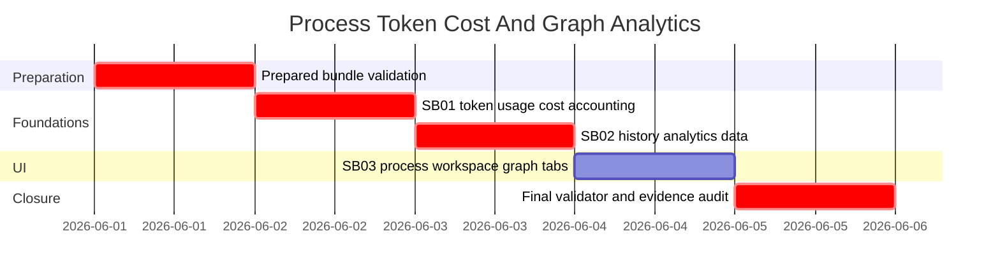

# Phase Plan

## Phase Sequence

1. Validate the prepared bundle and repair any missing coverage.
2. Execute SB01 token usage and cost accounting. Downstream work cannot start until cached-token propagation, no prompt double counting, and pricing proof pass.
3. Execute SB02 history analytics data. UI graph tabs cannot start until completed-run cost series and scoped graph queries are proven.
4. Execute SB03 process workspace graph tabs and browser validation.
5. Rerun the bundle validator, update proof manifests, close raw notes, and record residual risks.

## Subbundle Dependency Map

## Critical Subbundles

- SB01 is critical because process prices, live statistics, and historical charts depend on correct persisted `AgentRunMetric` values.
- SB02 is critical because SB03 must consume scoped, bounded analytics data rather than reimplementing history queries inside components.
- SB03 is UI-critical because it is the user-visible delivery of the new graph workflows and lazy-load behavior.

## Phase Gates

- Gate after preparation: run the bundle validator and repair any missing raw-note coverage, subbundle proof requirements, or browser-validation instructions.
- Gate before SB01: confirm current code inspection still matches `analysis/01-current-state.md`.
- Gate after SB01: targeted tests prove cached tokens are propagated, successful provider usage is not prompt-double-counted, and known pricing includes cached input.
- Gate after SB02: analytics tests prove completed priced runs appear in the selected history cost series and scoped process/run graph queries are bounded.
- Gate after SB03: component/browser proof shows the process all-runs graph button, range selector, selected-run graph tab, and no eager all-runs data loading.
- Gate before closure: rerun validators, update execution report, close every raw note, and state any proof gaps explicitly.
