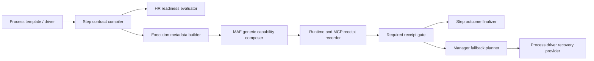

# Target Solution

## Design Goal

Introduce a process-owned capability and proof contract that is compiled once, evaluated before dispatch, carried through governed execution metadata, enforced against runtime receipts, and consumed by manager fallback. The implementation must make proof requirements explicit without moving process-domain knowledge into common MAF workspace tools.

## Proposed Flow

## Core Contracts

- `ProcessStepCapabilityContract`: immutable process-side contract for step capabilities, suppression, required tools/MCPs/skills, required receipts, and instruction fragments.
- `ProcessRequiredReceipt`: strongly typed requirement with provider kind, tool name or capability identity, minimum count, current-run requirement, and optional artifact expectation.
- `ProcessStepReadinessResult`: explains whether a selected agent and runtime can satisfy the contract before launch or dispatch.
- `ProcessRequiredReceiptGateResult`: explains which required receipts were satisfied or missing after an attempt.
- `ProcessFallbackPlan`: typed recovery decision for proof redispatch, reassignment, driver recovery, or NeedsAttention.

## Ownership

- Process templates and process drivers own domain-specific needs such as "QA recheck requires current browser screenshot and image analysis receipts".
- `CanDoItAll.Processes.Contracts` owns serializable public contract models.
- `CanDoItAll.Processes.Application` owns compilation, readiness, receipt-gate decisions, and fallback planning.
- `CanDoItAll.Modules.Processes` owns adaptation to AgentFramework execution metadata and UI projection surfaces.
- MAF owns generic runtime capability composition, invocation policy, tool receipts, and enforcement hooks.

## Performance Shape

- Compile the effective step contract from template snapshot, step key, role binding, and driver contribution once per process-plan hash or assignment readiness hash.
- Reuse existing capability catalogs and runtime capability planners; do not rebuild provider catalogs per agent turn.
- Prefer immutable records and value objects so compiled contracts can be cached safely.
- Keep services stateless or scoped to runtime orchestration; avoid per-tool service construction during each prompt assembly.

## Required Negative Behavior

- A step cannot complete successfully when `RequiredReceipts` contains current-run browser/image receipts that are absent.
- A fallback cannot silently synthesize missing proof from upstream artifacts.
- A process step cannot receive a suppressed skill, MCP, or runtime tool in agent context.
- A domain-specific instruction cannot be added inside common MAF workspace prompt normalization.
