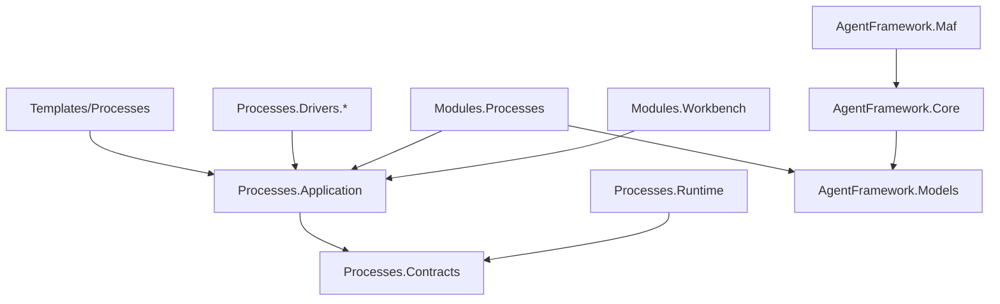

# C# Dependency Direction

## Allowed Direction

- Templates and UI call process application services.
- Process application services depend on process contracts, runtime abstractions, and driver abstractions.
- Module integration maps process contracts to MAF metadata.
- MAF models/core receive generic metadata and return generic capability/receipt results.

## Disallowed Direction

- MAF must not depend on process templates or software-delivery definitions.
- Process contracts must not depend on MAF concrete service implementations.
- Blazor components must not become the source of capability or proof policy.
- Driver implementations must not require UI projects.

## Proposed Dependency Shape

## Guardrails

- If implementation needs a new abstraction, first place it in the lowest layer that owns the decision.
- Do not add reverse references from MAF to `CanDoItAll.Processes.*`.
- Keep process-driver extension points narrow: contract contribution and fallback planning are enough unless implementation proof shows otherwise.
- Cache compiled contracts by stable process definition/run/step hash to avoid repeated dependency traversal.
