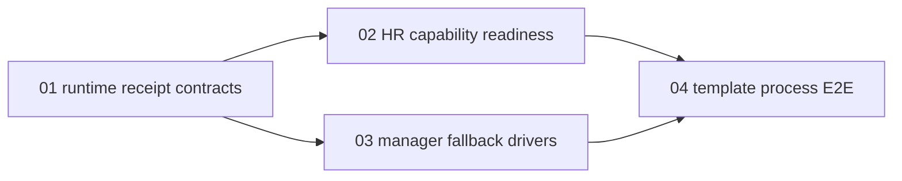

# Phase Plan

## Phase Sequence

1. Implement `01-runtime-receipt-contracts` first. This creates the typed contract and required receipt gate that every later phase depends on.
2. Implement `02-hr-capability-readiness` second. It consumes the contract to catch missing/suppressed tools, skills, MCPs, and access before launch or dispatch.
3. Implement `03-manager-fallback-drivers` third. It consumes receipt-gate diagnostics and routes recovery through manager fallback and process drivers.
4. Implement `04-template-process-e2e` last. It migrates process templates and validates the full software-delivery and screenshot/writeback scenarios.
5. After each subbundle, run targeted tests and update `reviews/01-execution-report.md`.

## Subbundle Dependency Map

## Critical Subbundles

- `SB01` `01-runtime-receipt-contracts`: critical foundation. Downstream readiness and fallback must consume its contract and diagnostics.
- `SB02` `02-hr-capability-readiness`: critical launch gate. Template E2E must not start until readiness reports tool/MCP/skill gaps accurately.
- `SB03` `03-manager-fallback-drivers`: critical recovery gate. Template E2E must not start until artifact-only recovery is blocked for missing proof receipts.
- `SB04` `04-template-process-e2e`: closure phase. It proves the migrated templates and runtime behavior together.

## Phase Gates

- Gate after preparation: run `python codex/skills/bundles/candoitall-bundle-preparation/scripts/validate_bundle.py --profile initiative --stage prepared codex/bundles/process-tool-proof-readiness-refactor`.
- Gate before each subbundle: confirm prerequisites, source paths, and architecture guardrails still match the current codebase.
- Gate after each subbundle: run targeted unit/integration tests, record proof paths, and update the execution report.
- Gate before closure: run full relevant .NET tests, template validation, and an E2E process run that includes browser and image receipts.
