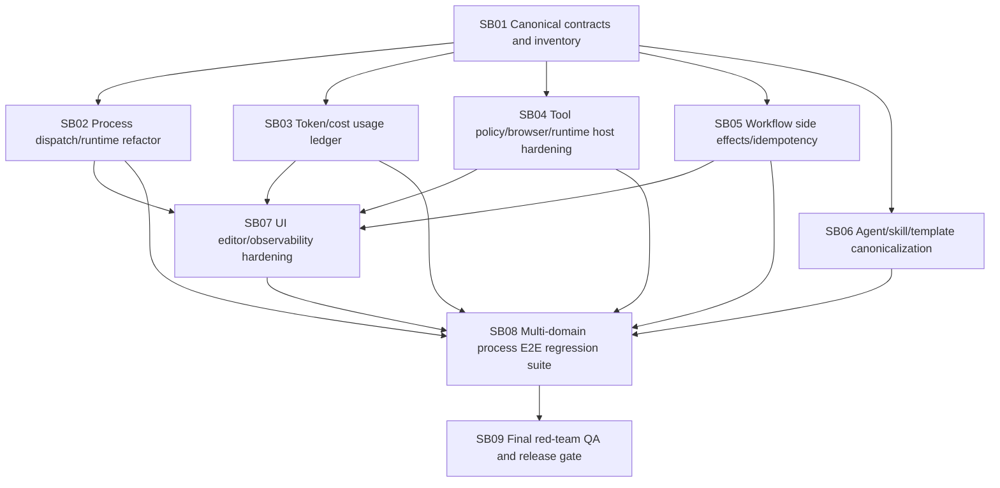

# Phase Plan

## Execution Order

1. SB01: Canonical contracts and inventory
2. SB02: Process dispatch/runtime refactor
3. SB03: Token/cost accounting and provider usage ledger
4. SB04: Tool policy, browser proof, and runtime host hardening
5. SB05: Workflow executor side effects and idempotency
6. SB06: Agent, skill, template canonicalization and active sync
7. SB07: UI editor and observability hardening
8. SB08: Multi-domain process E2E regression suite
9. SB09: Final red-team QA and release gate

## Subbundle Dependency Map

## Critical Subbundles

| Subbundle | Critical foundation reason |
| --- | --- |
| SB01 | All later refactors depend on canonical contracts and drift inventory. |
| SB02 | Process dispatch owns step execution, artifact acceptance, lineage, and state transitions. |
| SB03 | Token/cost accounting must be fixed before process cost claims can be trusted. |
| SB04 | Browser/runtime/tool proof must be trustworthy before E2E scenarios can prove behavior. |
| SB05 | External side effects must be safe before workflow regression runs. |
| SB06 | Agent/skill/template behavior must align before asking Codex/agents to run new scenarios. |
| SB08 | Real process E2E regression proves the hardening preserved generic app generation. |
| SB09 | Final verifier decides whether the refactor is releasable. |

## Phase Gates

### Gate after SB01

- Canonical inventory exists.
- Drift scanner exists and has a baseline.
- Critical proof manifest and semantic invariants exist.
- Downstream subbundles have updated source references if the inventory found renamed/moved files.

### Gate after SB02

- Process dispatch characterization tests pass.
- Artifact lineage/current-run validation rejects stale `49fd...` style references.
- Existing successful Tetris fixture path remains valid at unit/integration level.
- No new unowned string ids in process dispatch files.

### Gate after SB03

- Provider usage ledger tests pass.
- Finalizer short-circuit usage undercount is fixed or explicitly recorded as unknown with diagnostics.
- Failed-after-provider-call usage is preserved.
- Structured-output repair usage is linked.
- Process run detail exposes known/unknown usage separately.

### Gate after SB04

- Browser proof validator rejects stale/copy-only proof.
- Tool availability is deterministic from operation contract.
- Runtime command host cleanup receipts prevent build-lock regressions.
- Playwright proof requirements are represented in templates/skills/runtime policy consistently.

### Gate after SB05

- Office365/Gmail side-effect executors support dry-run/commit or have explicit unavailable diagnostics.
- Idempotency and processed-marker tests pass.
- No real evidence mailbox category is mutated during tests unless a controlled side-effect test explicitly states it.

### Gate after SB06

- Agents/templates/skills/API docs reference canonical contracts.
- Active Codex skill root hashes match repo skill hashes for changed skills.
- Removed MCP assumptions are not reintroduced.
- Downstream E2E prompts can rely on updated skills.

### Gate after SB07

- UI displays canonical statuses, executor availability, proof state, and usage/cost state.
- Playwright screenshots and interaction proof exist for changed UI areas.
- Numeric enum wire values are not shown as unexplained raw numbers in user-facing surfaces.

### Gate after SB08

- Five scenario process runs complete or have explicit, diagnosed, non-regression blockers.
- At least one browser proof per scenario validates domain behavior.
- Usage ledger summary exists per scenario.
- Genericity audit finds no Tetris-specific hidden logic.

### Gate after SB09

- Red-team attempts fail to fake proof, stale lineage, token undercount, side-effect duplicate processing, or hidden fallback.
- Final `scripts/validate_bundle.py --stage completed` passes.
- `candoitall-bundle-validator` final closure passes.
