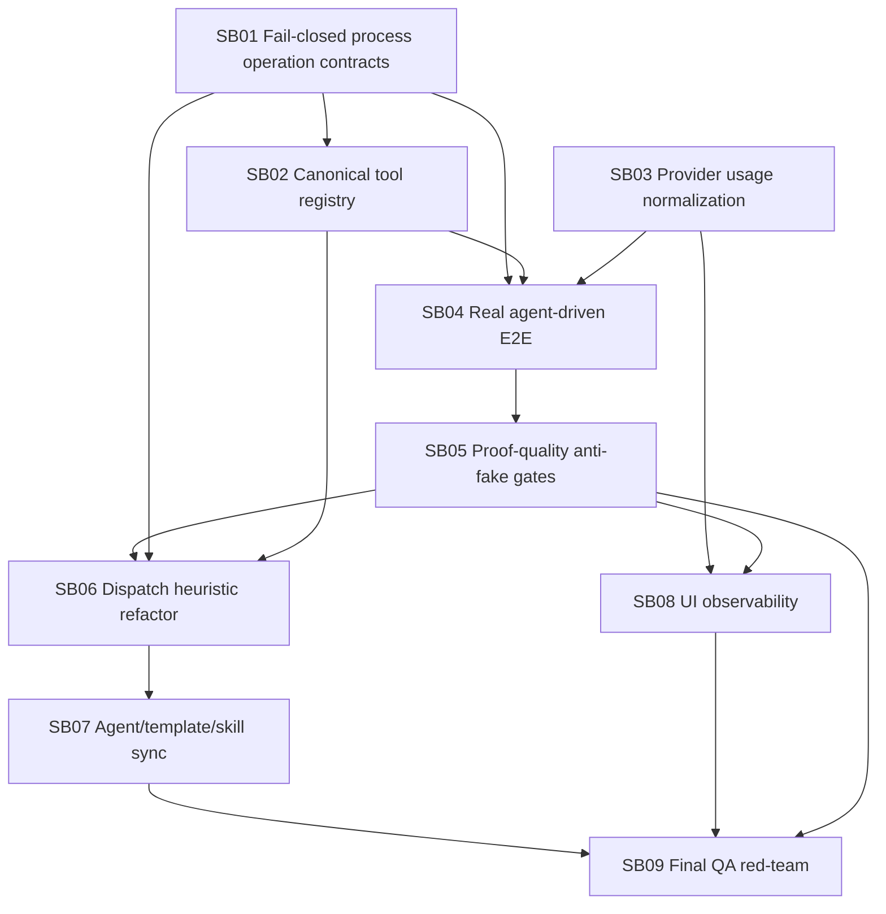

# Phase Plan

## Subbundle Dependency Map

## Critical Subbundles

Critical foundation subbundles: **SB01, SB02, SB03, SB04, SB05, SB06, SB07, SB09**.

SB08 is important but not a critical foundation for runtime safety. It is a visibility/operability subbundle and must not be used to compensate for missing runtime gates.

## Phase Gates

### Gate A: Contract and Registry Gate

Must pass before SB04 starts:

- SB01 strict governed contract tests pass.
- SB02 registry completeness tests pass.
- No known tool is unregistered.
- No unregistered tool falls back to `Read`.
- All process templates lint without missing operation contracts.

### Gate B: Usage Gate

Must pass before SB04 starts:

- SB03 raw usage normalizer handles OpenAI-style cached/reasoning/total/usage-null fixtures.
- Finalizer short-circuit and provider failure tests persist observations.
- Process actual cost uses observations and marks unknown usage honestly.

### Gate C: Real E2E Gate

Must pass before SB05 can close:

- Five scenario packets run with active automation dispatch.
- `suppressAutomationDispatch` is false or absent in production proof transitions.
- Each scenario has non-empty agent execution runs.
- Each scenario has tool receipts and current-run artifacts bound to execution run IDs.
- App source is produced by process/agent execution, not by harness helper strings.
- Usage summary is observed when provider calls occur; otherwise the run is marked blocked, not complete.

### Gate D: Proof Quality Gate

Must pass before SB06 and later refactor proof is accepted:

- New proof-quality checker fails against the old V1 SB08 proof for the expected reasons.
- New proof-quality checker passes against the new real E2E proof.
- Completed-stage validator refuses count-only and fixture-only proof for critical production behavior.

### Gate E: Refactor Gate

Must pass before SB09:

- Policy and dispatch services are split.
- Existing process happy path still passes.
- Negative tests for contract missing/tool unknown/stale proof still fail correctly.
- UI shows blocked/unknown/cost states correctly.

## Suggested Execution Order

1. SB01
2. SB02
3. SB03
4. SB04
5. SB05
6. SB06
7. SB07
8. SB08
9. SB09
