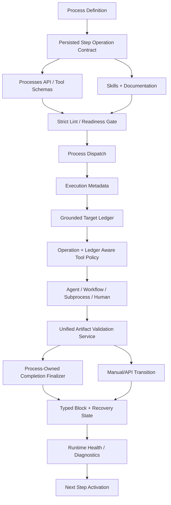

# Target runtime architecture v7

## Core principles

- Processes own lifecycle, artifacts, transitions, recovery, and governance.
- Workflows are below Processes and can only satisfy process roles through explicit process-owned mapping.
- Public API/tool models must be as authoritative as runtime models.
- Skills/docs are not optional; agent correctness depends on them.
- Text inference is fallback only.
- Typed governance metadata must be inspectable in UI, API, tests, and audit.
