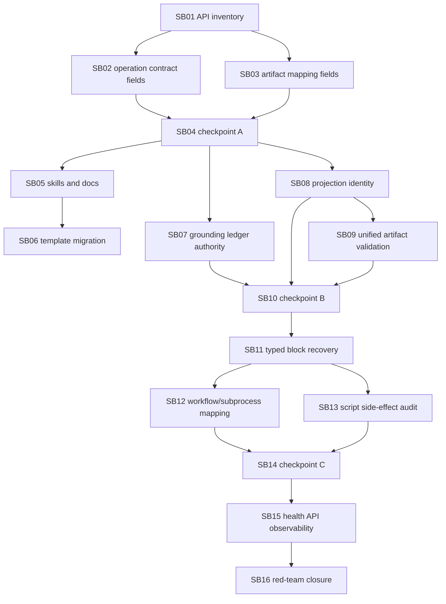

# Phase Plan

## Execution Order

1. SB01 processes API surface inventory and schema parity.
2. SB02 API/tool model operation contract fields.
3. SB03 API/tool model artifact output mapping fields.
4. SB04 refactor checkpoint A: API contracts and normalizers.
5. SB05 process skill and documentation update.
6. SB06 template migration beyond Blazor.
7. SB07 authoritative grounding ledger policy.
8. SB08 projection identity hash dedupe proof.
9. SB09 unified artifact validation service.
10. SB10 refactor checkpoint B: artifact lineage validation.
11. SB11 typed block cause and recovery router.
12. SB12 workflow/subprocess output mapping enforcement.
13. SB13 script side-effect manifest and post-execution audit.
14. SB14 refactor checkpoint C: recovery health API.
15. SB15 process health dashboard API and observability.
16. SB16 generic red-team harness and final closure.

## Subbundle Dependency Map



## Critical Subbundles

- SB01, SB02, SB03, SB05, SB06, SB07, SB08, SB09, SB11, SB12, SB13, SB15, and SB16 are critical because weak proof would invalidate public governance correctness.
- SB04, SB10, and SB14 are refactoring checkpoint gates that must pass before dependent feature work continues.

## Phase Gates

- Every subbundle must pass entry and closure gates before the next subbundle starts.
- After SB03 run SB04 before continuing.
- After SB09 run SB10 before continuing.
- After SB13 run SB14 before continuing.
- Critical subbundles require semantic adequacy proof, failing-first or adversarial proof, passing proof, source assertions, anti-stub audit, and changed-file hashes under `bundle://proof/SBxx/`.
- SB15 must provide API/read-model proof and browser or component proof if rendered UI changes.
- SB16 must run final focused tests, build, PostgreSQL-only audit, completed-stage bundle validator, and note-by-note raw closure.

## Required Commands

```powershell
python codex/skills/bundles/candoitall-bundle-preparation/scripts/validate_bundle.py codex/bundles/processes-hardening-followup-api-docs-governance-v7 --stage prepared --repo-root .
dotnet test tests/CanDoItAll.Tests.Unit/CanDoItAll.Tests.Unit.csproj --no-restore --filter "FullyQualifiedName~AgentToolInvocationPolicyTests"
dotnet test tests/CanDoItAll.Tests.Integration/CanDoItAll.Tests.Integration.csproj --no-restore --filter "FullyQualifiedName~ProcessRunAutomationDispatchServiceTests|FullyQualifiedName~ProcessesServiceIntegrationTests|FullyQualifiedName~ProcessDefinitionLinterTests"
dotnet test tests/CanDoItAll.Tests.Components/CanDoItAll.Tests.Components.csproj --no-restore --filter "FullyQualifiedName~ProcessStepEditorFormTests"
dotnet build CanDoItAll.slnx --no-restore
rg -n "Sqlite|SQLite|UseSqlite|Migrations.Sqlite" src tests codex/bundles/processes-hardening-followup-api-docs-governance-v7 -S
```
