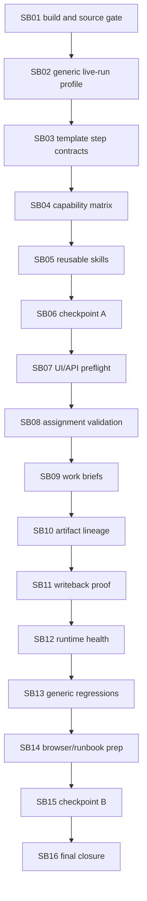

# Phase Plan

## Execution Order

1. SB01 verify phase8 fixes and build gate.
2. SB02 separate generic Blazor WASM PWA live-run profile from seeded regression data.
3. SB03 harden generic Blazor WASM PWA template step contracts.
4. SB04 build role/agent capability-skill-tool matrix.
5. SB05 add or upgrade Blazor WASM PWA and browser proof skills.
6. SB06 refactor checkpoint A for template and skill contracts.
7. SB07 UI/API import/start preflight.
8. SB08 agent assignment and tool profile validation.
9. SB09 work briefs that expose agent limitations.
10. SB10 artifact contracts, lineage, and current-run proof.
11. SB11 project-structure writeback proof.
12. SB12 runtime health debuggability.
13. SB13 generic template regression, including non-software and agent-training process patterns.
14. SB14 real UI test Playwright harness preparation.
15. SB15 refactor checkpoint B.
16. SB16 final red-team closure and live-test runbook.

## Subbundle Dependency Map



## Critical Subbundles

- SB02 is critical because generic profile separation prevents fake-completed live proof.
- SB03 is critical because template operation contracts control product mutation boundaries.
- SB08 is critical because missing tool validation determines whether agents can execute safely.
- SB10 is critical because current-run artifact lineage prevents stale or seeded proof from satisfying live requirements.
- SB16 is critical because final red-team closure checks topic-specific drift and fake proof across the whole bundle.

## Phase Gates

- SB01 must pass build/source assertions before template or runtime behavior changes proceed.
- SB02 must prove reusable templates and skills contain no app-topic-specific instructions before downstream Blazor hardening starts.
- SB03 must prove mutation is limited to implementation/repair before UI/API preflight and agent assignment validation proceed.
- SB08 must prove missing Blazor/browser/project-structure/process tools produce typed not-ready or blocked states before live-run proof preparation.
- SB10 must prove stale/seeded artifacts cannot satisfy current-run requirements before writeback and health closure.
- SB16 must run final source assertions, targeted tests, and closure validation before the bundle is marked complete.

## Required Validation Commands

```powershell
dotnet build CanDoItAll.slnx --no-restore
dotnet test tests/CanDoItAll.Tests.Unit/CanDoItAll.Tests.Unit.csproj --no-restore --filter "FullyQualifiedName~AgentToolInvocationPolicyTests"
dotnet test tests/CanDoItAll.Tests.Integration/CanDoItAll.Tests.Integration.csproj --no-restore --filter "FullyQualifiedName~ProcessRunAutomationDispatchServiceTests|FullyQualifiedName~ProcessesServiceIntegrationTests|FullyQualifiedName~ProcessDefinitionLinterTests|FullyQualifiedName~ApiIntegrationTests|FullyQualifiedName~ProcessTemplateGovernanceTests"
dotnet test tests/CanDoItAll.Tests.Components/CanDoItAll.Tests.Components.csproj --no-restore --filter "FullyQualifiedName~ProcessStepEditorFormTests|FullyQualifiedName~ProcessTemplate"
rg -n "Sqlite|SQLite|UseSqlite|Migrations.Sqlite" src tests Templates codex -S
```

## Template Audit Commands

```powershell
rg -n '"AllowedOperations"|"OperationTargetScope"' Templates/Processes/processes -S
rg -n '"MutateProductTarget"|"ExternalProductTargetMutable"' Templates/Processes/processes/blazor-* -S
rg -n -i 'tetris|tetromino|falling block|gameplay|simple game loop' Templates/Processes codex/skills/candoitall-api-processes src tests/CanDoItAll.Tests.Integration/ProcessesServiceIntegrationTests.cs tests/CanDoItAll.Tests.Integration/ProcessRunAutomationDispatchServiceTests.cs tests/CanDoItAll.Tests.Components/ProcessWorkspaceTests.cs -S
rg -n 'project_structure_asset_create|project_structure_node_create|project_structure_' src Templates codex -S
```
