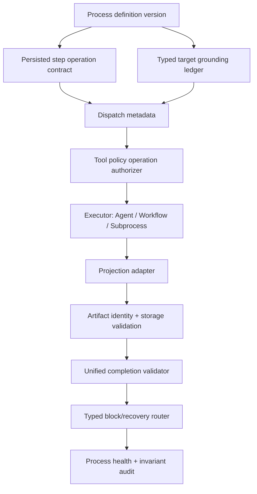

# Target Architecture

## Design

- Tool policy must consume a typed ledger, not just alias strings.
- Completion validation must be a shared service used by automated finalizer and manual/API transitions.
- Artifact identity must not depend on bounded display reference strings.
- Recovery must be typed and executable, not just a reason string and a list of options.
- Legacy heuristics remain only as compatibility fallback with visible warnings.
