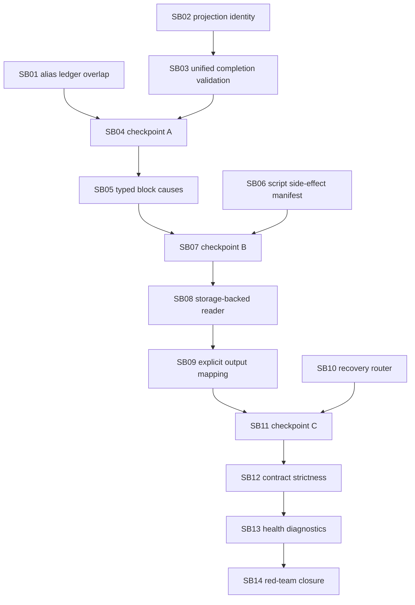

# Phase Plan

## Execution Order

1. SB01 alias-ledger overlap and read-only autopromotion
2. SB02 projection identity hash and artifact dedupe
3. SB03 unified completion artifact validation
4. SB04 refactor checkpoint A: metadata/contract/grounding extraction
5. SB05 typed block-state cause propagation
6. SB06 script side-effect manifest and post-script audit
7. SB07 refactor checkpoint B: tool policy and artifact validator extraction
8. SB08 storage-service-backed artifact content reader
9. SB09 explicit workflow/subprocess output mapping
10. SB10 recovery router and actionable lifecycle
11. SB11 refactor checkpoint C: recovery/health/modular runtime services
12. SB12 contract strictness, lint gates, and template migration
13. SB13 process health invariant dashboard and diagnostics
14. SB14 generic scenario harness and final red-team closure

## Subbundle Dependency Map



## Critical Subbundles

- SB01, SB02, SB03, SB05, SB06, SB08, SB09, SB10, SB12, SB13, and SB14 are critical because weak proof would invalidate downstream runtime correctness.
- SB04, SB07, and SB11 are checkpoint subbundles that protect maintainability and must pass before downstream feature work continues.

## Phase Gates

- Every subbundle must pass entry and closure gates before the next subbundle starts.
- Every subbundle must update its proof manifest and semantic invariant file.
- Critical subbundles must include shallow-pass trap, adversarial negative proof, semantic positive proof, anti-stub audit, and raw-note closure evidence.
- Refactoring checkpoints after SB03, SB06, and SB10 must rerun focused tests and update architecture notes.
- Final closure must run the focused unit/integration/component tests, full build, PostgreSQL-only audit, and completed-stage bundle validator.

After SB03, SB06, and SB10 run the refactoring checkpoint. Do not proceed if refactoring leaves large monolithic methods untested.

## Required Commands

```powershell
python codex/skills/bundles/candoitall-bundle-preparation/scripts/validate_bundle.py codex/bundles/processes-hardening-followup-runtime-correctness-v6 --stage prepared --repo-root .
dotnet test tests/CanDoItAll.Tests.Unit/CanDoItAll.Tests.Unit.csproj --no-restore --filter "FullyQualifiedName~AgentToolInvocationPolicyTests|FullyQualifiedName~AgentWorkspaceToolAccessMetadataTests"
dotnet test tests/CanDoItAll.Tests.Integration/CanDoItAll.Tests.Integration.csproj --no-restore --filter "FullyQualifiedName~ProcessRunAutomationDispatchServiceTests|FullyQualifiedName~ProcessesServiceIntegrationTests|FullyQualifiedName~ProcessDefinitionLinterTests"
dotnet build CanDoItAll.slnx --no-restore
rg -n "Sqlite|SQLite|UseSqlite|Migrations.Sqlite" src tests codex/bundles/processes-hardening-followup-runtime-correctness-v6 -S
```
