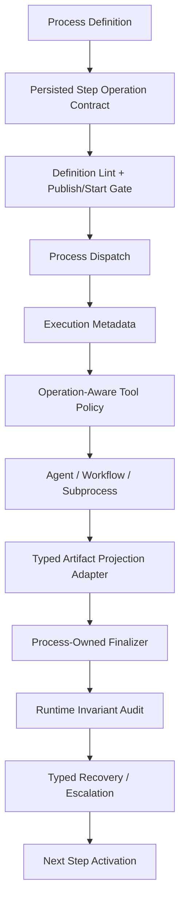

# Target Runtime Architecture

## Key Shift

The process runtime should not depend on keyword guessing for core governance. The next version should use persisted typed contracts and only use heuristics as fallback/migration helpers.

## Required Runtime Concepts

- `ProcessStepOperationContract`
- `ProcessStepOperation`
- `ProcessStepTargetScope`
- `GroundedTargetAliasLedger`
- `ArtifactProjectionIdentity`
- `ProcessArtifactOutputMapping`
- `ProcessRuntimeInvariantViolation`
- `ProcessBlockReasonCode`
- `ProcessRecoveryOption`
