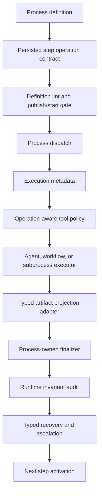

# Target Solution

The target solution is a typed process-runtime governance layer. Process definitions persist operation contracts, dispatch emits typed execution metadata, tool policy enforces operation authorization, artifact projection uses typed lineage and explicit mappings, finalization validates storage-backed artifact content, and post-step auditing detects policy bypasses before downstream steps proceed.

## Design Constraints

- Keep process concepts generic across business planning, legal review, manufacturing QA, HR, incident response, software delivery, and research.
- Keep workflows below processes. Workflow state may satisfy a process role only through explicit process-owned mapping and validation.
- Keep PostgreSQL-only runtime assumptions. Do not add SQLite runtime paths or SQLite migrations.
- Prefer persisted typed state over prompt text, keyword parsing, or bounded display keys.
