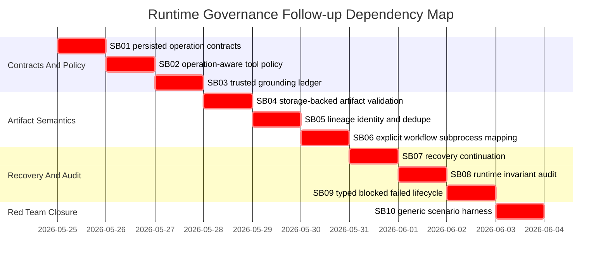

# Phase Plan

## Subbundle Dependency Map



## Execution Order

1. SB01: persisted step operation contract fields.
2. SB02: operation-aware tool policy.
3. SB03: trusted grounding source ledger.
4. SB04: storage-backed artifact validation.
5. SB05: artifact lineage identity.
6. SB06: workflow/subprocess output mapping.
7. SB07: recovery continuation.
8. SB08: runtime invariant audit.
9. SB09: typed blocked/failed lifecycle.
10. SB10: generic scenario harness.

## Critical Subbundles

- All subbundles are critical because each owns runtime governance semantics.
- SB01-SB03 form the authorization foundation. Do not start SB04 until persisted contracts, operation-aware policy, and trusted target grounding are proven.
- SB04-SB06 form the artifact semantics foundation. Do not start SB07 until stored content, lineage identity, and explicit output mapping are proven.
- SB08 and SB09 are closure foundations. SB10 must not pass if runtime invariant violations or typed recovery states are only prose.

## Phase Gates

- Prepared-stage bundle validation must pass before implementation starts.
- Each subbundle must pass an entry gate before code edits and a closure gate before the next subbundle starts.
- Critical proof must include failing-first or red-team proof, passing proof, source assertions, anti-stub audit, and changed-file hashes.
- Final closure must include focused tests, full build, PostgreSQL-only audit, proof manifests, and raw-note closure.

### Prepared gate

Run before implementation and after material bundle-contract edits.

```powershell
python codex/skills/bundles/candoitall-bundle-preparation/scripts/validate_bundle.py codex/bundles/processes-hardening-followup-runtime-governance-v5 --stage prepared --repo-root .
```

### Focused integration tests

```powershell
dotnet test tests/CanDoItAll.Tests.Integration/CanDoItAll.Tests.Integration.csproj --no-restore --filter "FullyQualifiedName~ProcessRunAutomationDispatchServiceTests|FullyQualifiedName~ProcessDefinitionLinterTests"
```

### Focused unit tests

```powershell
dotnet test tests/CanDoItAll.Tests.Unit/CanDoItAll.Tests.Unit.csproj --no-restore --filter "FullyQualifiedName~AgentToolInvocationPolicyTests|FullyQualifiedName~AgentWorkspaceToolAccessMetadataTests"
```

### Full confirmation

```powershell
dotnet test tests/CanDoItAll.Tests.Unit/CanDoItAll.Tests.Unit.csproj --no-restore
dotnet test tests/CanDoItAll.Tests.Integration/CanDoItAll.Tests.Integration.csproj --no-restore
dotnet build CanDoItAll.slnx --no-restore
```

### PostgreSQL-only audit

```powershell
rg -n "Sqlite|SQLite|UseSqlite|Migrations.Sqlite" src tests codex/bundles/processes-hardening-followup-runtime-governance-v5 -S
```

Expected: no new SQLite runtime or migration dependency introduced.

## Closure Gate

The bundle is complete only when:

- focused unit/integration tests pass,
- process definition linter tests pass,
- operation-aware tool policy tests pass,
- workflow/subprocess mapping tests pass,
- artifact validation tests pass,
- run-start/publish lint gate tests pass,
- no SQLite runtime is reintroduced,
- full solution build passes,
- generic red-team scenarios pass.
