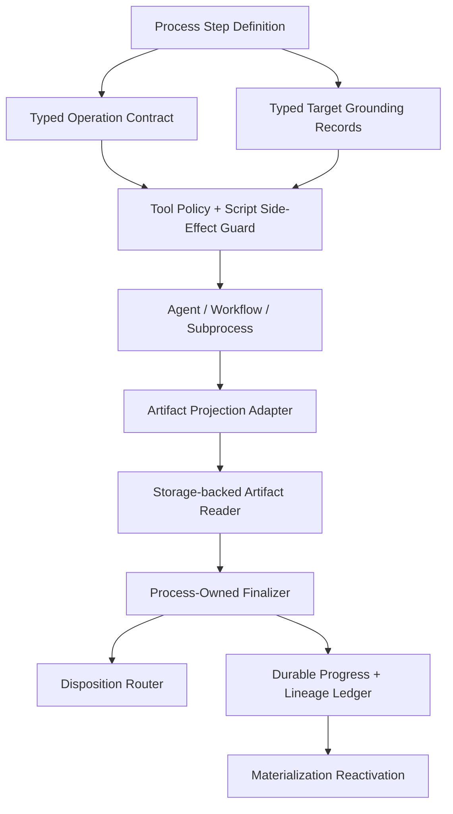

# Target Runtime Integrity Architecture

## Core Design

Move from string-derived governance to typed runtime contracts.



## New/Improved Production Concepts

### ProcessStepOperationContract

Persisted on `ProcessStepDefinition` or a related one-to-one entity.

Fields:

- `AllowedOperationsJson`
- `TargetScope`
- `DispositionPolicy`
- `RetryPolicy`
- `ArtifactPolicy`
- `ContractSource` (`Explicit`, `MigratedFromText`, `Inferred`)
- `ContractConfidence`

### ProcessTargetGroundingRecord

Typed runtime grounding for targets.

Fields:

- `ProcessRunId`
- `StepRunId`
- `Alias`
- `NativePath`
- `SourceKind`
- `Permission`
- `TrustStatus`
- `PromotedBy`
- `CreatedAtUtc`

Source kinds:

- `ProjectStructureCurrentRun`
- `LaunchPlan`
- `StepDefinition`
- `UpstreamArtifactReference`
- `ToolReceipt`
- `TextMention`

Writable aliases must not come from `TextMention`.

### ProcessArtifactProvenanceRecord

Typed lineage for artifacts.

Fields:

- `ProcessArtifactRecordId`
- `SourceKind`
- `SourceExecutionRunId`
- `RecoveryExecutionRunId`
- `RecoveredForExecutionRunId`
- `WorkflowRunId`
- `WorkflowArtifactId`
- `SubprocessRunId`
- `SourceArtifactId`
- `ReworkPacketId`
- `ContentHash`
- `CreatedAtUtc`

### Storage-backed Artifact Reader

A service used by finalizer validation:

```csharp
public interface IProcessArtifactContentReader
{
    Task<ProcessArtifactContentReadResult> ReadAsync(ProcessArtifactRecord artifact, CancellationToken cancellationToken);
}
```

### Durable No-Progress Ledger

A table or journal convention that records:

- process run id
- step run id
- execution run id
- failure fingerprint
- mutation/proof delta
- tool signature
- artifact validation fingerprint
- retry decision
- next action
