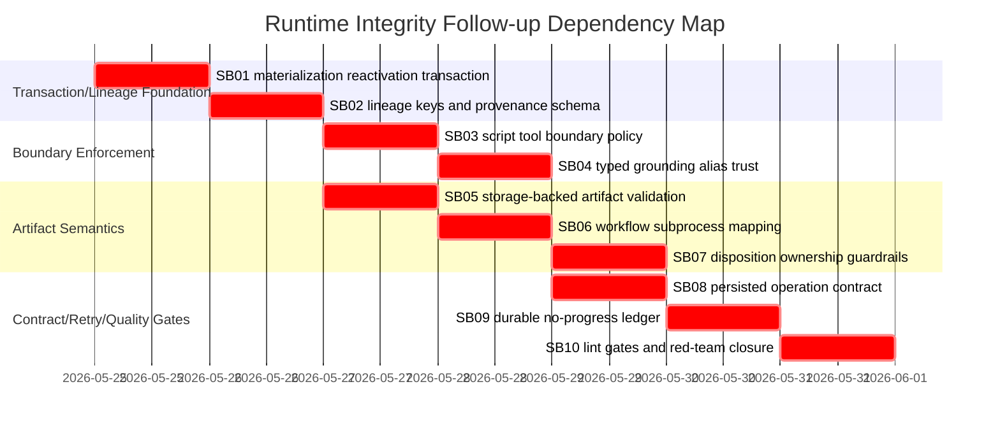

# Phase Plan

## Subbundle Dependency Map



## Critical Subbundles

All subbundles are critical. SB01 and SB02 are the foundation: do not start downstream work if materialization or lineage remains unreliable.

## Phase Gates

### Prepared gate

```powershell
python codex/skills/bundles/candoitall-bundle-preparation/scripts/validate_bundle.py --stage prepared codex/bundles/processes-hardening-followup-runtime-integrity-v4
```

### Focused runtime tests

```powershell
dotnet test tests/CanDoItAll.Tests.Integration/CanDoItAll.Tests.Integration.csproj --no-restore --filter "FullyQualifiedName~ProcessRunAutomationDispatchServiceTests|FullyQualifiedName~ProcessDefinitionLinterTests"
```

### Focused tool policy tests

```powershell
dotnet test tests/CanDoItAll.Tests.Unit/CanDoItAll.Tests.Unit.csproj --no-restore --filter "FullyQualifiedName~AgentToolInvocationPolicyTests|FullyQualifiedName~AgentWorkspaceToolAccessMetadataTests"
```

### Full confirmation

```powershell
dotnet test tests/CanDoItAll.Tests.Unit/CanDoItAll.Tests.Unit.csproj --no-restore
dotnet test tests/CanDoItAll.Tests.Integration/CanDoItAll.Tests.Integration.csproj --no-restore
dotnet build CanDoItAll.slnx --no-restore
```

### PostgreSQL-only audit

```powershell
rg -n "Sqlite|SQLite|UseSqlite|Migrations.Sqlite" src tests codex/bundles/processes-hardening-followup-runtime-integrity-v4 -S
```

Expected: no new SQLite runtime or migration dependency introduced.
